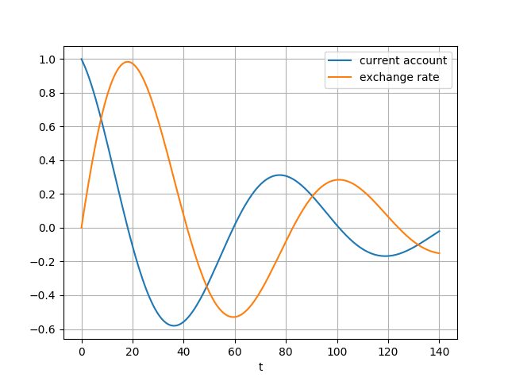
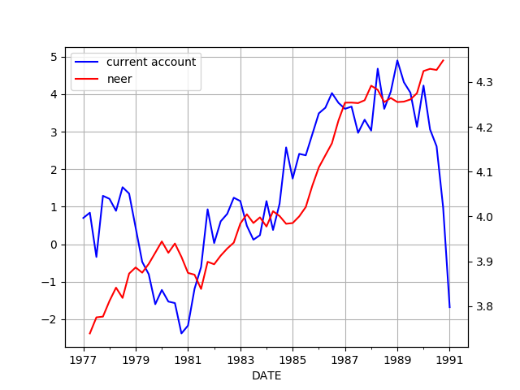

# Exchange Rates

Based on excerpts from [1]. First some definitions,

$z(t)$: Current account

$q(t)$: Real exchange rate

$k(t)$: Autonomous capital flows

$r(t)$: Official sales of foreign reserves

$d(t)$: "Accommodating" capital flows, under normal circumstances,
current account imbalances are financed by it.

$c(t)$: International payment flows

International cash is a central determinant of the exchange rate.

$$
\dot{q} \approx -\xi c(t), \qquad (5)
$$

We assume that the real exchange rate is the major driving force
behind the trade balance and therefore behind the current account,
$z(t)$. An appreciated real exchange rate leads to a deterioration of
a country's international competitiveness and thus puts a downward
pressure on the trade balance; a weak real exchange rate, on the other
hand, strengthens the trade balance. The parameter $\phi_1$ determines
the speed with which the current account reverts to equilibrium

$$
\dot{z}(t) = -\phi_1 z(t)  - \phi_2 q(t) \qquad (6a)
$$

Balance of payments identity in our model can be stated as

$$
z(t) + d(t) + k(t) + c(t) + r(t) = 0 \qquad (8)
$$

Absent official intervention in the foreign exchange market,
international payment flows, $c(t)$, are driven by the sum of a
country's current account and its financial balance

$$
c(t) = -z(t) - k(t) - d(t)
$$

However, when a country wants to stabilize its exchange rate, it needs
to offset any cross-border payment flows... the net quantity of
foreign reserves that the authorities need to sell in this case is
therefore:

$$
r(t) = -z(t) - k(t) - d(t)
$$


### Models

All models use the following constants,

$$
\xi = 0.1, \phi_1 = 0.03, \phi_2 = 0.06, \phi_3 = 0.1, \gamma = 0.05
$$

Model 1

Use (5) and (6a). 

$$
q(0) = 0, z(0) = 1
$$

```python
from scipy.integrate import odeint
import pandas as pd

phi1 = 0.03
phi2 = 0.06
gamma = 0.05
xi = 0.1

def dmod1(y, t):
    z, q = y
    return [-(phi1*z) - (phi2*q), xi*z]

t = np.linspace(0, 140, 200)
y0 = [1.0,0.0]
sol = odeint(dmod1, y0, t)
df = pd.DataFrame( sol )
df.columns = ['current account','exchange rate']
df['t'] = t
df = df.set_index('t')
df.plot()
plt.savefig('mod1.png')
```



### NEER

[Def](https://www.investopedia.com/tervms/n/neer.asp): The nominal
effective exchange rate NEER is an unadjusted weighted average rate
at which one country's currency exchanges for a basket of multiple
foreign currencies. The nominal exchange rate is the amount of
domestic currency needed to purchase foreign currency. In economics,
the NEER is an indicator of a country's international competitiveness
in terms of the foreign exchange -forex- market

[Data](https://www.bruegel.org/publications/datasets/real-effective-exchange-rates-for-178-countries-a-new-database),
for every country goes back to 70s,

Let's look at Germany current account and exchange rate,

```python
import pandas as pd, datetime
from pandas_datareader import data
start=datetime.datetime(1977, 1, 1)
end=datetime.datetime(1991, 1, 1)
# german current account
df2 = data.DataReader(['BPBLTT01DEQ188S'], 'fred', start, end)
```

```python
import pandas as pd, zipfile
with zipfile.ZipFile('/tmp/REER_database_ver6Apr2020.zip', 'r') as z:
    df1 =  pd.read_excel(z.open('REER_database_ver6Apr2020.xls'),sheet_name='NEER_MONTHLY_38')
```

```python
df1 = df1[[df1.columns[0], 'NEER_38_DE']]
df1.columns = ['date','DE']
df1['date'] = df1['date'].str.replace('M','')
df1['date'] = pd.to_datetime(df1['date'],format="%Y%m")
df1 = df1.set_index('date')
df1 = np.log(df1)
df1 = df1[(df1.index > '1977-01-01') & (df1.index < '1991-01-01')]
```

```python
df = df2.join(df1)
ax1 = df.BPBLTT01DEQ188S.plot(color='blue', grid=True, label='current account')
ax2 = df.DE.plot(color='red', grid=True, label='neer',secondary_y=True)
h1, l1 = ax1.get_legend_handles_labels()
h2, l2 = ax2.get_legend_handles_labels()
plt.legend(h1+h2, l1+l2, loc=2)
plt.savefig('neer-de.png')
```




References

[1] Muller-Plantenberg, [PhD Dissertation](http://etheses.lse.ac.uk/2681/)

[2] Muller-Plantenberg, [Balance of payments accounting and exchange rate dynamics](https://www.researchgate.net/publication/46490787_Balance_of_payments_accounting_and_exchange_rate_dynamics)

