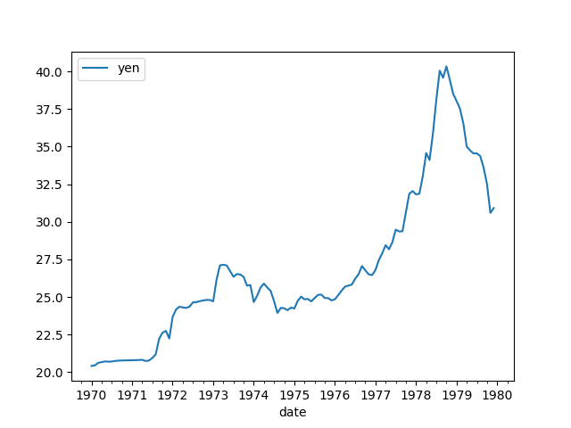

# Exchange Rate

Excerpts from [1]. For now only model 1. 

$z(t)$: Current account

$q(t)$: Real exchange rate

$k(t)$: Autonomous capital flows

$r(t)$: Official sales of foreign reserves

$d(t)$: Under normal circumstances, current account imbalances are
financed by “accommodating” capital flows

$c(t)$: International payment flows

$$
\dot{q} \approx \xi c_1(t), \qquad (5)
$$

We assume that the real exchange rate is the major driving force
behind the trade balance and therefore behind the current account,
$z(t)$. An appreciated real exchange rate leads to a deterioration of
a country's international competitiveness and thus puts a downward
pressure on the trade balance; a weak real exchange rate, on the other
hand, strengthens the trade balance. The parameter $\phi_1$ determines
the speed with which the current account reverts to equilibrium

$$
\dot{z}(t) = -\phi_1 z(t)  - \phi_2 q(t) \qquad (6a)
$$

Balance of payments identity in our model can be stated as

$$
z(t) + d(t) + k(t) + c(t) + r(t) = 0 \qquad (8)
$$

Absent official intervention in the foreign exchange market,
international payment flows, $c(t)$, are driven by the sum of a
country's current account and its financial balance

$$
c(t) = -z(t) - k(t) - d(t)
$$

However, when a country wants to stabilize its exchange rate, it needs
to offset any cross-border payment flows... the net quantity of
foreign reserves that the authorities need to sell in this case is
therefore:

$$
r(t) = -z(t) - k(t) - d(t)
$$


### Models

$$
\xi = 0.1, \quad \phi_1 = 0.03, \quad \phi_2 = 0.06, \quad \phi_3 = 0.1, \eta = 0.05
$$

Model 1

(5) and (6a)

$$
q(0) = 0, z(0) = 1
$$

```python
from scipy.integrate import odeint

phi1 = 0.03
phi2 = 0.06
xi = 0.1

def dmod1(y, t):
    z, q = y
    return [-(phi1*z) - (phi2*q), xi*z]

t = np.linspace(0, 140, 200)

y0 = [1.0,0.0]

sol = odeint(dmod1, y0, t)
plt.plot(t,sol[:,0])
plt.savefig('mod1.png')
```


## NEER

From https://www.investopedia.com/terms/n/neer.asp

The nominal effective exchange rate (NEER) is an unadjusted weighted
average rate at which one country's currency exchanges for a basket of
multiple foreign currencies. The nominal exchange rate is the amount
of domestic currency needed to purchase foreign currency. In
economics, the NEER is an indicator of a country's international
competitiveness in terms of the foreign exchange (forex) market

Data is at, for every country goes back to 70s

https://www.bruegel.org/publications/datasets/real-effective-exchange-rates-for-178-countries-a-new-database

```python
import pandas as pd, zipfile
with zipfile.ZipFile('/tmp/REER_database_ver6Apr2020.zip', 'r') as z:
    df =  pd.read_excel(z.open('REER_database_ver6Apr2020.xls'),sheet_name='NEER_MONTHLY_38')
```

```python
df1 = df[[df.columns[0], 'NEER_38_JP']]
df1.columns = ['date','yen']
df1['date'] = df1['date'].str.replace('M','')
df1['date'] = pd.to_datetime(df1['date'],format="%Y%m")
df1 = df1.set_index('date')
df1 = df1[(df1.index > '1969-01-01') & (df1.index < '1980-01-01')]
df1.plot()
plt.savefig('neer-jp.png')
```




References

[1] Muller-Plantenber, PhD Dissertation, http://etheses.lse.ac.uk/2681/

[2] Muller-Plantenber, Balance of payments accounting and exchange rate dynamics, https://isiarticles.com/bundles/Article/pre/pdf/79576.pdf


