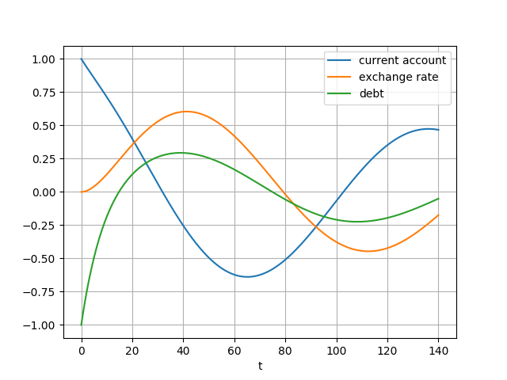
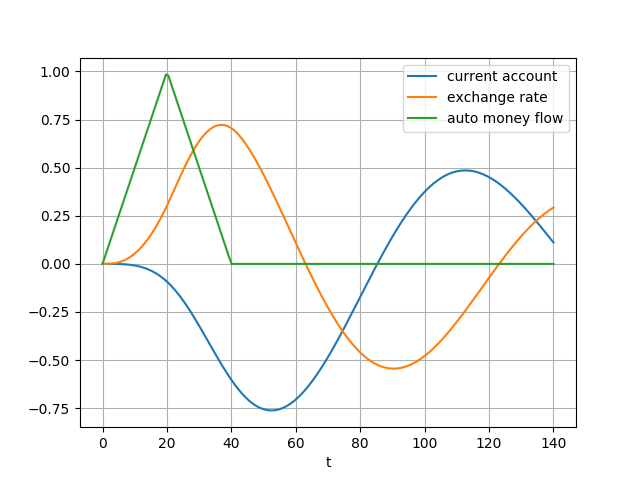
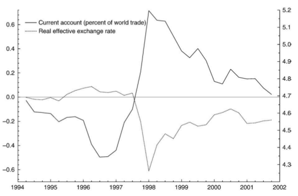

# Exchange Rates

Based on excerpts from [1]. First some definitions,

$z(t)$: Current account

$q(t)$: Real exchange rate

$k(t)$: Autonomous capital flows

$r(t)$: Official sales of foreign reserves

$d(t)$: "Accommodating" capital flows, under normal circumstances,
current account imbalances are financed by it.

$c(t)$: International payment flows

International cash is a central determinant of the exchange rate.

$$
\dot{q} \approx -\xi c(t), \qquad (5)
$$

We assume that the real exchange rate is the major driving force
behind the trade balance and therefore behind the current account,
$z(t)$. An appreciated real exchange rate leads to a deterioration of
a country's international competitiveness and thus puts a downward
pressure on the trade balance; a weak real exchange rate, on the other
hand, strengthens the trade balance. The parameter $\phi_1$ determines
the speed with which the current account reverts to equilibrium

$$
\dot{z}(t) = -\phi_1 z(t)  - \phi_2 q(t) \qquad (6a)
$$

Balance of payments identity in our model can be stated as

$$
z(t) + d(t) + k(t) + c(t) + r(t) = 0 \qquad (8)
$$

Absent official intervention in the foreign exchange market,
international payment flows, $c(t)$, are driven by the sum of a
country's current account and its financial balance

$$
c(t) = -z(t) - k(t) - d(t) \qquad (9)
$$

However, when a country wants to stabilize its exchange rate, it needs
to offset any cross-border payment flows... the net quantity of
foreign reserves that the authorities need to sell in this case is
therefore:

$$
r(t) = -z(t) - k(t) - d(t) \qquad (10)
$$


### Models

All models use the following constants,

$$
\xi = 0.1, \phi_1 = 0.03, \phi_2 = 0.06, \phi_3 = 0.1, \gamma = 0.05
$$

### Model 1

Use (5) and (6a). 

$$
q(0) = 0, z(0) = 1
$$

```python
from scipy.integrate import odeint
import pandas as pd

phi1 = 0.03
phi2 = 0.06
gamma = 0.05
xi = 0.1

def dmod1(y, t):
    z, q = y
    return [-(phi1*z) - (phi2*q), xi*z]

t = np.linspace(0, 140, 200)
y0 = [1.0,0.0]
sol = odeint(dmod1, y0, t)
df = pd.DataFrame( sol )
df.columns = ['current account','exchange rate']
df['t'] = t
df = df.set_index('t')
df.plot(grid=True)
plt.savefig('mod1.png')
```


### NEER

[Def](https://www.investopedia.com/tervms/n/neer.asp): The nominal
effective exchange rate NEER is an unadjusted weighted average rate
at which one country's currency exchanges for a basket of multiple
foreign currencies. The nominal exchange rate is the amount of
domestic currency needed to purchase foreign currency. In economics,
the NEER is an indicator of a country's international competitiveness
in terms of the foreign exchange -forex- market

[Data](https://www.bruegel.org/publications/datasets/real-effective-exchange-rates-for-178-countries-a-new-database),
for every country goes back to 70s,

Let's look at Germany current account and exchange rate,

```python
import pandas as pd, datetime
from pandas_datareader import data
start=datetime.datetime(1977, 1, 1)
end=datetime.datetime(1991, 1, 1)
# german current account
df2 = data.DataReader(['BPBLTT01DEQ188S'], 'fred', start, end)
```

```python
import pandas as pd, zipfile
with zipfile.ZipFile('/tmp/REER_database_ver6Apr2020.zip', 'r') as z:
    df1 =  pd.read_excel(z.open('REER_database_ver6Apr2020.xls'),sheet_name='NEER_MONTHLY_38')
```

```python
df1 = df1[[df1.columns[0], 'NEER_38_DE']]
df1.columns = ['date','DE']
df1['date'] = df1['date'].str.replace('M','')
df1['date'] = pd.to_datetime(df1['date'],format="%Y%m")
df1 = df1.set_index('date')
df1 = np.log(df1)
df1 = df1[(df1.index > '1977-01-01') & (df1.index < '1991-01-01')]
```

```python
df = df2.join(df1)
ax1 = df.BPBLTT01DEQ188S.plot(color='blue', grid=True, label='current account')
ax2 = df.DE.plot(color='red', grid=True, label='neer',secondary_y=True)
h1, l1 = ax1.get_legend_handles_labels()
h2, l2 = ax2.get_legend_handles_labels()
plt.legend(h1+h2, l1+l2, loc=2)
plt.savefig('neer-de.png')
```


### Model 2

What happens when part of the current account transactions are
financed by debt? Then (9) becomes (with $k(t)$ still zero),

$$
c(t) = -z(t) - d(t) 
$$

So (5) is expanded to

$$
\dot{q} \approx -\xi c(t) = -\xi (z(t) + d(t))
$$

The question is what to do with debt, $d(t)$, or how to model it
within ODE system as $\dot{d}(t)$. The $d(t)$ formulation in [1] is
somewhat cumbersome, put forth for analytic solution which we do not need,

$$
d(t) = -(z(t) + k(t)) - \gamma D(t)
$$

where $D(t)$ contains an integral that computes all debt until time
$t$ of which a portion $\gamma$ is paid off. We can assume all debt
until $t$ is $d(t)$, then a decaying formulation for $\dot{d}$ is
easy. Together with $z(t)$ and $k(t) = 0$, it becomes,

$$
\dot{d} = -\dot{z}-\gamma d(t) \qquad (7)
$$

Using this formulation, and with somewhat different constants, the
integration looks like,

```python
from scipy.integrate import odeint
import pandas as pd

phi1 = 0.03
phi2 = 0.06
gamma = 0.1
xi = 0.04

def dmod2(y, t):
    z, q, d = y
    zdot = -(phi1*z)-(phi2*q)
    return [zdot, xi*(z+d), -zdot - gamma*d   ]

t = np.linspace(0, 140, 200)
y0 = [1.0, 0.0, -1]
sol = odeint(dmod2, y0, t)
df = pd.DataFrame( sol )
df.columns = ['current account','exchange rate','debt']
df['t'] = t
df = df.set_index('t')
df.plot(grid=True)
plt.savefig('mod2.png')
```



Real-world example is Japan. Flows of debt securities to and from
Japan were minimal prior to the country's financial liberalization in
the late 1970s and in the first half of the 1980s. Starting in the
mid-1980s, these flows became much more sizable, reflecting primarily
Japan's large financial investments in the United States. On the other
hand, the lag between the current account and the yen exchange rate,
which was not very large in the 1970s, became much larger in the 1980s
and 1990s.


### Model 3

With this model there are autonomous international cash flows into the
country, $k(t) \ne 0$. Then,

$$
c(t) = -z(t) - d(t) - k(t)
$$

With $k(t)$ being non-zero,

$$
\dot{q} \approx -\xi c(t) = -\xi (z(t) + d(t) + k(t))
$$

In the simulated model $k(t)$ can be defined through an auxilary
function, with its derivative,

$$
k(t) = \left\\{ \begin{array}{l}
0.05 t \quad 0 \le t < 20,  \\\\
2 -0.05t \quad  20 \le t < 40 \\\\
0 \quad 40 \le t 	
\end{array} \right.,
$$

$$
\dot{k}(t) = \left\\{ \begin{array}{l}
0.05  \quad 0 \le t < 20,  \\\\
-0.05 \quad  20 \le t < 40 \\\\
0 \quad 40 \le t 	
\end{array} \right.
$$

The time series' that are generated by this model can be seen below.
As capital inflows surge, foreign cash starts to flow into the
country, pushing up the demand for the domestic currency. In this
situation, the current account deteriorates, as it often occurs in
countries experiencing foreign investment booms. The emerging current
account deficit will sooner or later exceed the autonomous capital
inflows as these are only temporary. The country may still be able to
attract loans from abroad to close its financing gap. Yet as the
deficit persists and foreign loans have to be paid off, the country
finds itself at some point sending more money abroad than it itself
receives. At this moment, the exchange rate, which has been
appreciating continuously from the very start, starts to
fall. However, it takes some time until it has depreciated
sufficiently to bring about a turnaround in the current account.

```python
from scipy.integrate import odeint
import pandas as pd

def k(t):
    if t >= 0 and t<20.0: return 0.05*t
    if t >= 20.0 and t<40.0: return 2.0-0.05*t
    else: return 0

def dk(t):
    if t >= 0 and t<20.0: return 0.05 
    if t >= 20.0 and t<40.0: return -0.05
    else: return 0

from scipy.integrate import odeint
import pandas as pd

phi1 = 0.03
phi2 = 0.06
gamma = 0.2
xi = 0.05

def dmod3(y, t):
    z, q, d, k = y
    zdot = -(phi1*z)-(phi2*q)
    qdot = xi*(z+d+k)
    kdot = dk(t)    
    ddot = -zdot -kdot - gamma*d
    return [zdot, qdot, ddot, kdot ]

t = np.linspace(0, 140, 200)
y0 = [0.0, 0.0, 0, 0.0]
sol = odeint(dmod3, y0, t)
df = pd.DataFrame( sol )
df.columns = ['current account','exchange rate','debt','auto money flow']
df['t'] = t
df = df.set_index('t')
df[['current account','exchange rate','auto money flow']].plot(grid=True)
plt.savefig('mod3.png')
```



### Model 4

Let's analyze fixed exchange rate and how payment flows into and out
of those countries evolve in response to trade and capital flows, and
how the stock of foreign exchange reserves of those countries is
affected. Our goal is to model the incidence of a currency crisis, in
a way that is consistent with empirical and anecdotal evidence.

We change (6a) to be

$$
\dot{z}(t) = \phi_1 z(t) - \phi_2 q(t) - \phi_3 k(t)
$$


(5), and (7) are still the same. Under the fixed exchange rate regime,
reserve flows, $r(t)$, neutralize any payments between foreign and
domestic residents.  However, we assume that the available stock of
reserves is limited to an arbitrary, but not too high.

I coded this through a derivative below `drfun`, through trial-error
so that rises in $r$ would be stopped at a certain point, and be
driven to zero.

Once devaluation occurs, no more foreign exchange intervention takes
place. As in the previous model, the country, which starts off without
any debt, receives capital inflows over an initial period, see
Eq. (13). Finally, international cash flow and net sales of reserves
are governed by Eqs. (9) and (10) respectively.

```python
from scipy.integrate import odeint
import pandas as pd

def drfun(rr,t):
    if t <= 40: return rr
    elif t > 40 and t<50: return -0.07
    else: return 0

phi1 = 0.03
phi2 = 0.06
phi3 = 0.1
gamma = 0.1
xi = 0.05

def dmod4(y, t):
    z, q, d, k, r = y
    c = -z - d - k - r
    qdot = -0.01*c
    zdot = -phi1*z - phi2*q - phi3*k
    kdot = dk(t) 
    ddot = -zdot-kdot-gamma*d
    rdot = drfun(-zdot -ddot - kdot, t)
    return [zdot, qdot, ddot, kdot, rdot ]

ts = np.linspace(0, 140, 200)
y0 = [0.0, 0.0, 0, 0.0, 0.0]
sol = odeint(dmod4, y0, ts)
df = pd.DataFrame( sol )
df.columns = ['z','q','d','k','r']
df['t'] = ts
df = df.set_index('t')
df[['z','q','k','r']].plot(grid=True)
plt.savefig('mod4.png')
```


The results are above. As in the previous model of a flexible exchange
rate, the initial capital inflows contribute to a gradual worsening of
the current account by encouraging domestic consumption and
investment. The current account declines even though we have ruled out
any real appreciation of the currency since we assumed that the
inflation differential is zero. Initially, the country is able to
build up reserves since the sum of capital flows exceeds the emerging
current account deficit. Capital inflows are temporary, however, and
foreign lenders are unwilling to finance the entire deficit. At some
stage, the country's authorities have to start selling reserves to
keep the exchange rate from falling.

Following the removal of the fixed exchange rate regime defined in
`drfun` , the currency falls precipitously. The country's exports
become more competitive in global markets, whereas imports become more
expensive for domestic residents. The current account, already on its
way up, thus receives another strong impetus from the low currency and
switches towards a strong surplus, which in turn helps the domestic
currency to gain ground.



Let's compare this with South Korea's economic experience during the
Asian crisis. Like other emerging markets, Korea witnessed strong
private capital inflows during the early and mid-1990s. Those inflows
were facilitated by the removal and relaxation of capital account
restrictions.

By 1996, Korea's current account, measured as a percentage of world
trade, had already reached record levels and the question of
sustainability started to become an issue; domestic investment had for
a long time been very high in the East Asian economies, placing doubts
on its quality (McKinnon & Pill, 1997). Although the current account
deficit declined somewhat in early 1997, this was not enough to
prevent the subsequent collapse of the won and several neighbouring
currencies. The rather dramatic devaluation of the exchange rate
helped to boost the trade balance and the current account, which wrote
record surpluses only a few months after.  In Korea, the funds were
not only used to increase domestic investment; they also served to
accumulate reserves and keep the won strong. Ultimately though, the
current account deficit became unsustainable, and with it the Korean
exchange rate. That foreign investors lost faith at some point and
started to pull out their capital only precipitated the collapse.

References

[1] Muller-Plantenberg, [PhD Dissertation](http://etheses.lse.ac.uk/2681/)

[2] Muller-Plantenberg, [Balance of payments accounting and exchange rate dynamics](https://www.researchgate.net/publication/46490787_Balance_of_payments_accounting_and_exchange_rate_dynamics)

