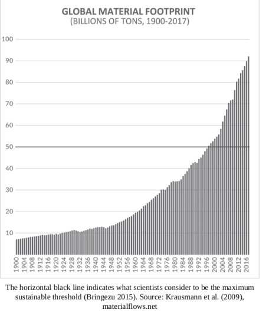

# Goods, Materials, Hickel

When we look at the impact that growthism has had on our planet since
the 1980s, it makes the period of enclosure and colonisation seem
quaint by comparison. All of the land and resources that colonisers
appropriated across multiple continents and pulled into the juggernaut
of capital – all of that has been dwarfed many times over.

We can see this playing out in the statistics on raw material
consumption.  This metric tallies up the total weight of all the stuff
humans extract and consume each year, including biomass, metals,
minerals, fossil fuels and construction materials. These figures tell
an astonishing story. They show a steady rise of material use in the
first half of the 1900s, doubling from 7 billion tons per year to 14
billion tons per year.

But then, in the decades after 1945, something truly bewildering
happens. As GDP growth becomes entrenched as a core political
objective around the world, and as economic expansion starts to
accelerate, material use explodes: it reaches 35 billion tons by 1980,
hits 50 billion tons by 2000, and then screams up to an eye-watering
92 billion tons by 2017.

The graph [below] is almost breathtaking to look at. Of course, some
of this increase represents important improvements in people’s access
to necessary goods (in other words, use-value), particularly in poorer
parts of the world; and we should celebrate that. But most of it does
not. Scientists estimate that the planet can handle a total material
footprint of up to about 50 billion tons per year. 13 That’s
considered to be a maximum safe boundary.  Today we’re exceeding that
boundary twice over...

Lithium is another ecological disaster. It takes 500,000 gallons of
water to produce a single ton of lithium. Even at present levels of
extraction this is causing real problems. In the Andes, where most of
the world’s lithium is located, mining companies are burning through
the water tables and leaving farmers with nothing to irrigate their
crops. Many have had no choice but to abandon their land
altogether. Meanwhile, chemical leaks from lithium mines have poisoned
rivers from Chile to Argentina, Nevada to Tibet, killing off whole
freshwater ecosystems. The lithium boom has barely started, and it’s
already a catastrophe

