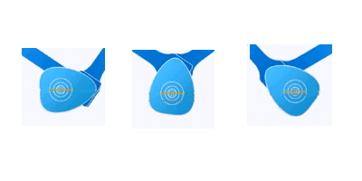
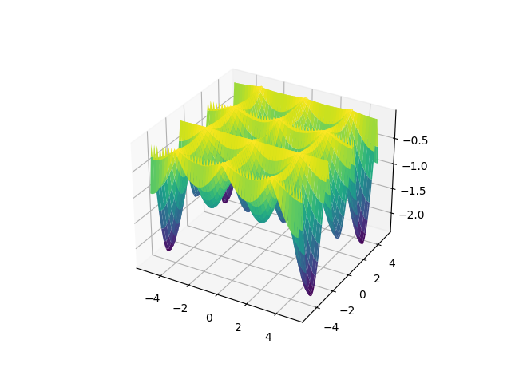

# Good Reductionism and Nonlinear Power

*Das Ganze ist etwas anderes als die Summe seiner Teile* (the whole
is something else than the sum of its parts) -- Kurt Koffka

I hear criticisms using the words "oh but that's too reductionist" on
analysis' that involve breaking an issue into individual
components.. This criticism is usually misguided and I will try to
outline why. Such criticism misses the interaction, the nonlinearity
of those "pieces" and on the reverse side, the power that results due
to the combination of those little pieces, that gave us much of the
modern world today. It's key we understand both sides of this
equation.

There are many systems, some mechanical, some social. In those systems
we see pieces, but how are they held together? How were they added?
*Linear* addition of components is uninteresting.. They are simple to
see, and frankly will not achieve much beyond their domain.  Twice of
something that do X, can do 2X. I have A, add B, I get A+B. There is
nothing to this. The analysis and creation of such mechanisms yield to
average results.

However when scientists analyze interesting systems, or engineers
build them, what they look for is individual components, yes, but also
the *nonlinear ways* they can interact. It is this interaction that
leads to power.

Let's look at the way the V-engine shaft turns,



It is a simple rotation. One shaft. There are two other rods connected
to it. But look at how that connection is made, at different
angles. Rotation, easy. Connecting, easy. Rods, easy. But connect two,
to the same shaft, at angle, gives you this,

[Video](https://drive.google.com/uc?export=view&id=18wE8NaHsydycnITM_OGuDX3WMrjndPgN)

We just created an orderly movement, one push after another, and guaranteed
certain force, using "simple components".

What if I wanted to create a push action at different intervals, not
just regular?

I immediately try to think of simple components, and try to achieve
nonlinearity through interactions.. Simple rotation. Simple rod. But
the rotating object is not round, has certain nonlinear shape which is
how it interacts with the rod, and that in turn gets pushed in an
interval I want.

[Video](diff-rhytm.gif)

Another subject, one I studied closely, optimization. In this subject,
we run our algorithms on "funky 3D shapes" that are famous for having
many ups and downs, we want tricky shapes bcz the minima searching
algs usually looks to its nearby region, we want to see if they will
"fall" into one of those holes and get stuck there. So the subject
over the years zoned in to a few of those funky shapes as example
shapes that are the result of short, simple formulas (great, easy to
code).  Here is one of those famous functions, called the Hölder table
function,


```python
import pandas as pd
import numpy as np
import matplotlib.pyplot as plt
from mpl_toolkits.mplot3d import Axes3D    
from matplotlib import cm

L = 5
x = np.linspace(-L, L, 100)
y = np.linspace(-L, L, 100)
X, Y = np.meshgrid(x, y)                            
Z = -np.abs( np.sin(X)*np.cos(Y)*np.exp(np.abs( 1- np.sqrt(X**2+Y**2)/np.pi  ))  )

fig = plt.figure()
ax = fig.gca(projection='3d')                      
surf = ax.plot_surface(X, Y, Z, cmap=cm.viridis)
plt.savefig('out.png')
```



Its formula is

$$
f(x,y) =
-
\bigg|
\sin(x) \cos(y) \exp \left( \bigg| 1 - \frac{\sqrt(x^2+y^2)}{\pi}  \bigg| \right)
\bigg| 
$$

Short and sweet. There is a boring cosine, boring sine, x and y,
booring, and a few additions.. But let's see how are these components
put together; Nonlinearly.

Sine *times* cosine, *squared* x and y, only *then* added. The result
is "the table" we see, nothing that we could have guessed by just
looking at the individual components.. The whole is something else
than the sum of its parts entirely, and by sum I mean linear sum.

Same with music. Here are the components that make up K-Pop band BTS's
song Dynamite, written by the British composer David Stewart [2]. 

<table>
<tr>
<td>
<audio controls="controls">
  <source src="https://drive.google.com/uc?export=view&id=12Jo-UCYO80oBnz2GDVf5HFldtapS3i5I">
</audio>
</td>
<td>
<audio controls="controls">
  <source src="https://drive.google.com/uc?export=view&id=1ooRjn-sHR8AfkTrGiUo2HQPJBgVbozGk">
</audio>
</td>
<td>
<audio controls="controls">
  <source src="https://drive.google.com/uc?export=view&id=1KLMiRvfR-8hDn_H1mg9ejw2d4TEavqng">
</audio>
</td>
</tr>
<tr>
<td>
<audio controls="controls">
  <source src="https://drive.google.com/uc?export=view&id=1f4rtgBiXMxaDcRFrt17VJ8JSOeIdUyu1">
</audio>
</td>
<td>
<audio controls="controls">
  <source src="https://drive.google.com/uc?export=view&id=1yabQPKCpt1f9EY3cXkERfE11MdhdI2Ya">
</audio>
</td>
<td>
<audio controls="controls">
  <source src="https://drive.google.com/uc?export=view&id=1wEg_g574E1EaOkIznjld2Q6P9u0Hdy4i">
</audio>
</td>
</tr>
<tr>
<td>
<audio controls="controls">
  <source src="https://drive.google.com/uc?export=view&id=1-6fDaf5y6L6Dhjhv3w1bjtJ_5zA974ss">
</audio>
</td>
<td>
<audio controls="controls">
  <source src="https://drive.google.com/uc?export=view&id=1-Z1mtAwsJ5TwYJPv8B0e4MV3-GCJ5roa">
</audio>
</td>
<td>
<audio controls="controls">
  <source src="https://drive.google.com/uc?export=view&id=1YHatoBHUfzY66L7QIkJjTUVUT6tpYzj9">
</audio>
</td>
</tr>
</table>

Simple, boring tracks right?

But they are crafted in a certain way, to fit in a certain way, so
when they are finally placed together, this results,

<audio controls="controls">
  <source src="https://drive.google.com/uc?export=view&id=1MzNva_prkzCmM2O3FmhtotyOtU1AtHvD">
</audio>

Systems Analysis 

When scientists analyze complex systems, and if they came up with
simple additive looking results, we need to be careful, look beyond
it, and see if they used nonlinearity elsewhere. $u_x + u_t = 0$ might
seem an seem inocuous looking statement, but that subscript hides
concept from differential calculus that took centuries to perfect. So
scientists sometimes smush, twist, bend a problem to get a "linear
superposition", but lest be mistaken, there will be much nonlinearity
hidden in the path of getting there. It's like taking the log of
exponential data that gives you a simple, straight line. The act of
taking the log, and recognizing the exponential curve is what gave us
that linear line.

Social Implications

Social systems can also be constructed out of simple elements. In that
case of course the components would be humans themselves or human
groups. This is why democracies delivered more than authoracies, bcz
they allowed individual groups (parties) to form around possible
solutions, which then come together in myriad ways to govern. This
process was in fact the perfect example of nonlinear interactions of
simple, focused components.. I join a party arguing for high taxes,
some in low, our oscillations in and out of gov, sometimes together,
lands us in an optimal solution. We pursued our simple, focused view,
came together in certain ways that led us somewhere: optimality. 

We have to admit the West has been a good follower of these ideas. The
East, with the exception of perhaps India, and a few Asian
democracies, still does not get **it**. China fears the components (ie
its citizens), how they can come together, so opresses their
interactions, and the human elements themselves. These countries are
stuck in First Wave agrarian mentality, where X + X got you 2X. More
land, more peasants, more
produce. The-whole-large-than-the-sum-of-parts gives you something
different entirely. It leads to much ability, and power. This is how
the British dominated the seas, their biggest trick was combining a
clock, with a reference point and simple math. This allows the
calculation of the correct longitude, and that combined with simple
latitude info, gave te ships their precise locations on Earth. 

Note

Philosophers stumbled upon on the idea at times in the East; Ghazali
said for instance "you combine something with something else, you get
a third thing". He was aware of combinations, but did not offer
further formulation. His pin factory studies seperate competencies,
types of workers working on different part of a product, but he
thought overall efficiency was achieved because same people working on
the same type of problem made them faster thereby improving the
overall efficiency.. This means he missed the point entirely, the
power lies not simple addition of the components however good they
might be, it lies in their interactions, how they jell with another,
and the myriad ways they can produce a solution.

The West can go awry in its prevelant use of this method, at least, in
a subconcious level. The fear of
[Frankenstein](2020/07/robot-frankenstein.md), of industry, now of AI
can be seen as an example of this, as a society it has seen how
interactions of simple components brought much power, and sure, deep
net neural "AI" solutions are composed of such simple things,
neurons. What is missed here that such combinations need to be
crafted, very carefully, for every problem, which makes it hard for
any system going "productively berserk", or even step outside its
programming in an malicious way.

References

[1] https://en.wikipedia.org/wiki/Test_functions_for_optimization

[2] [The Making of BTS Dynamite](https://youtu.be/qBCM1Fy-ByY)

