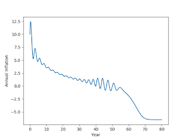

Question

Previous model on employment / debt  was good; but what about inflation

What about inflation..

Here is the extended [model](keen_math) (see bottom of same doc) with
price levels / inflation. This one demonstrates the "the great
moderation" followed by ka-boom. Here is the money shot,

Deflation right there. mmmmm hhmmmm - snap.

Why is the anti-immigrant German party AFD named that way?

Because of Merkel Probably

The flippant answer would be "well, because the name nationalsozialistisch was taken" (for golf, it is "because shit was taken"). But seriously, I think the reason is Merkel keeps using the word "alternativlos" when describing why she chose a certain approach, meaning "alternative-less", which ties in with TINA talked about earlier. That kind of answer truly drives people up the wall, some anyway, so naming this party as alternative for germany (alternative fur deutschland) was probably an F-- you towards the Chancellor.

This is another side effect to TINA governments - US take heed - when you say this is the alternativeless center for any set of solutions and there can be no other, well, then the next question is what's the need for other parties? It can push people to radicalize on even secondary issues - such as in US over environmental and gun control. The TINA politics might jell with the top 20%, the white-collar professionals, but it is not always optimal from all angles, and it certainly is not without alternative. TINA ppl can also be severely beaten at elections if someone crafts an opposition, sometimes being thumb-in-your-eye obnoxiously opposite of these people are. Then there is bunch of drama. See US.

NPR

Nixon, a Republican, who created the EPA in 1970. In the following years, he also signed off on the Clean Water Act and the Clean Air Act with broad bipartisan support, cementing a legacy as one of America's greenest presidents. [..]

Public pressure was immense. The environment was one of the top issues people voted on and politicians felt it. The Clean Air Act was passed in the Senate by a vote of 73-0. Not a single lawmaker — Republican or Democrat — voted against it.

In those days, Ruckelshaus says, people viewed the environment and public health as one and the same.

Gone Are Those Days

Here is an issue first spearheaded by a Republican, but it was "weaponized" by the corporate Democrats, and now it belongs to one column never to be seen or heard from again.

Question

Can an economic crisis happen again?

It is only natural

I was able to replicate the results from the Keen model (see
[notebook](keen_math.md)). It is a nonlinear dynamic model - a
collection of simple equations which together can demonstrate highly
nonlinear behaviour. In such systems there are fixed points, some can
be seen as desirable stable situations. For some reasonable
parameters, on such fixed point is employment level at 96%, wage share
of GDP at 83% and private debt percentage at 7% (if one parameter v
representing efficiency is higher debt can go up more). If the system
is sufficiently away from there parameters, all quickly degenerates -
shooting towards another fixed point, no employment, infinite
debt. This is hell. Right now US wage share (which means salaries, for
middle class) is at around 44%, employment is at 81%, private debt
share is at 200%. 

If the underpinnings of the model is correct, and it looks that way,
the conclusion is a lot of economies are artificially held away from
crisis with great effort, the natural course is, with the given debt,
inequality, is for everything to go to shit. Keen has some ideas to
fix these, QE for people for example, direct payments to everyone that
will first go to paying off debt.

K. has additional models for Ponzi financing, and inflation. This
paper has a good overview.

