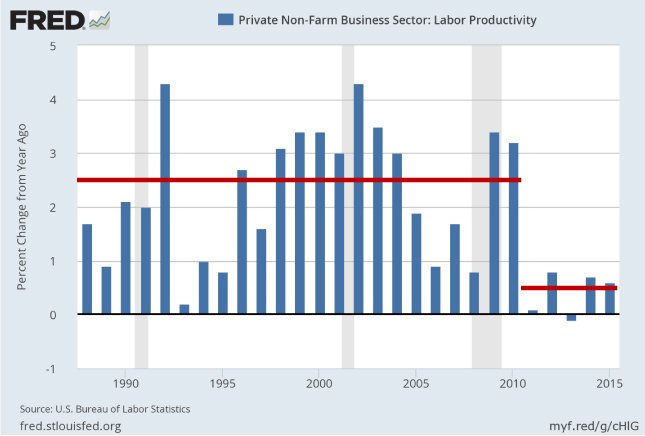

Wow.. A lot of female Trek fans dislike Disco STD too; So Woke stuff doesn't work on them.. it doesn't work on the guys.. Who is this shit really made for? It's like, losing audience is considered an accomplishment these days?

*2019-4-29 15:38:40*

--

This is pussyxploitation. Just like blaxploitation movies of 70s.. 

[Link](/thirdwave/en/2011/12/blaxploitation.html)

"Part Devil, Part Legend, All Man!!"

It's crass stuff and probably even worse than its older counterpart. At least they tried to appeal to some. STD... is weird. All agenda, top to bottom.

*2019-4-29 15:38:40*

---

---

It helps not seeing life as a movie. The *big* event, reward, harps play, spotlight turns on. This guy Kudlow said that too "everything in my life led to this (after joining WH)" asshole had a heart attack few weeks later. Not a movie.

https://twitter.com/jenheemstra/status/1124723833007681536

---

Russiagate was bunch of hot air but I disagree with some peeps who got it right; it worked. A little. Some less dumb leftists fanned the flames 4 that reason, acting completely in a utilitarian fashion. 

It's an ugly business. Little too hacky 4 me tho.

---

Legendre transform.. show your secrets to meeeeee

---

@mathematicsprof

"Some people never get the honors they deserve in their lifetime. Johann Radon, who introduced the Radon Transform, which later became the basis for the CT scan is such a person. --> https://bit.ly/2EWovay   Are there others who never got proper accolades in their lifetime?"

---

@jongalloway

Changing settings in Modern UI's:

1. Look for a gear icon
2. Look for a hamburger somewhere
3. Look for a ... menu
4. Click on your face
5. Read release notes: "bug fixes and performance improvements"
6. Give up

---

It doesn't matter what ppl think. They are morons (on policy they do
not experience 1st hand). They vote on people, on character. Leaders
need to lead.

"Scientists overwhelmingly agree that climate is changing because of
human activity. But public opinion in the US remains mixed. As of
2016, less than half of Americans believe that the Earth is getting
warmer due to human activity"

---

It doesn't matter what ppl think. They are morons (on policy they do not experience 1st hand). They vote on people, on character. Leaders need to lead.

By this token UNGA could decide Venezuella to be invaded (refugees >5%, the truest sign of imbecilic fuckup, a mistake for which neighbors are paying the price), Columbia, Brasil all voting yey.

---

Latest bans are over the line. The hammer needs to come down.

---

@sugabelly

The Caster Semenya controversy is honestly more about the fact that Intersex people are the legitimate third gender, and they’ve been ignored so long with so few options.

There should be an Intersex sporting category. 

It’s unfair to women to race against Caster, and to her too

---

Producivity growth. Look at how low it is recently

Sad truth is the economy does not need so many workers or farmers. 2% generate the food in US. <15% are blue collar workers. We dont need f--ing teachers. Sorry.

The reason is same amt of output is generated with less people, displaced ppl go to shit jobs (which is most of the jobs) for which the need is questionable, overall productivity goes down.

---

Every country is stuck in the wave they were born. TR invented farming, still tries to increase employment in "sheepf--ing" i.e. piss poor farmer tied to a land (and his goat). Industrial nations want full-employment in industry that pays fair "wage".

---

@philipcball

Graham: "Loop quantum gravity?"

Witten: "Those are just words. There aren't any other routes [besides string theory]."

@pascalkwanten

Replying to @philipcball

I think Edward Witten is too narrow minded with his tunnel vision on string/M-theory as the(!) only way. Not one (new) testable prediction has been made by string theory. (Besides the microscopic explanation of BH entropy and many math conjectures). The era Edward Witten is over.

---

@EconguyRosie

Manufacturing diffusion index down. Incomes down. Workweek down. Household survey employment down. Full-time jobs down. Participation rate down. This was not a strong report beyond the headline.

---

If I cant hook up a cheap H2 / clean fuel canister to a scooter / light travel device and have it go for > 50 km in less than 10 yrs I will be a very unhappy man. I stress the word VERY. If we are alive by then.

---

Bremmer trying to defend belt and road "(parap) some countries in LatAm and EU dont object to South China see islands anymore bcz they get $$ from Ch". That's bcz America's view is the only 1 that matters. Others' non-objection is cheap. I think CH is the 1 losing here.

---

"Have smaller farms so there more farmers". This is the stupidest idea
I've ever heard.

The one thing my dad (an agricultural engineer, talked abt here
https://muratk3n.github.io/thirdwave/en/2011/08/living-in-factory.html
…) keeps saying for 30 yrs is changing TR land inherit laws so land is
not divided (i.e. smaller)

Bcz there are incredible efficiencies in big lands, industrialized
farming that way.

Dingbat populists and the left fall in this trap all he the time;
aiming full employment. Once they aim for it, guess what, they get
it. But efficiency is lost. Every1 hates work, become cynical

Growth falters, wages suck (bcz ppl _really_ are not needed in this
economy), no inflation, no savings, just big ugly bubbles in places
ppl now cannot touch - the stock market and real estate.

---

