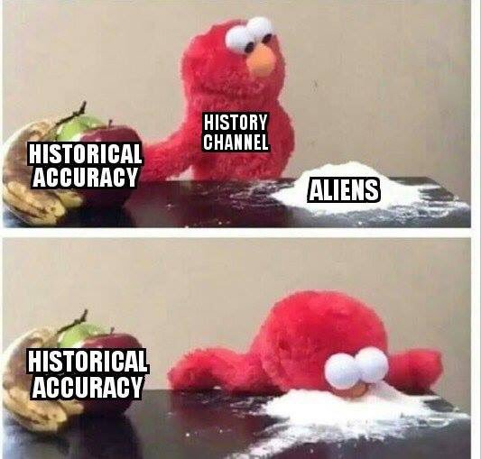

<blockquote class="twitter-tweet" data-lang="en">
I&#39;m running for President (D) to build a new economy, one that puts people first.  A Freedom Dividend of $1k/month, Medicare for All, and Human-Centered Capitalism will help us achieve this goal.  Join our campaign and let&#39;s solve the real problems. <a href="https://t.co/OvoGKOhrwi">https://t.co/OvoGKOhrwi</a> <a href="https://t.co/Re3Ems6pds">pic.twitter.com/Re3Ems6pds</a>
&mdash; Andrew Yang (@AndrewYang) <a href="https://twitter.com/AndrewYang/status/1090297958430580736?ref_src=twsrc%5Etfw">January 29, 2019</a></blockquote>

---

No superhero makes Europeans laugh more than Batman. There's something abt that character..  I guess too over the top. Iron Man is fine. Not Batman.

---
 
@ChartNotes

"With the first FED cut we get a spike in equities(Yay! Stimulus) , then after about the 3rd cut people realize why they are cutting(recession) and the market tanks...Everytime." 

        ~ Raoul Pal

---

Dubai's massive solar energy site. Energy storage method: molten salt -

https://www.forbes.com/sites/johnparnell/2018/12/31/dubai-makes-progress-in-pursuit-of-round-the-clock-solar-power/

---

Really? Interesting.

"Millennials, who are not only the largest generation now in the labor force, but also the most supportive of unions, at 68 percent." The Atlantic

---

25/1 "Australia's heatwave has moved to Melbourne, where the city
braced for its hottest day since Black Saturday in 2009. Temperatures
in Melbourne reached 44 C on Friday"

---

With RBF reduction / interpolation I can represent the terrain of 20k
km^2 with 5 MB model. Whole earth = less than half a gig. Thatz some
useful math. U can store model on phone and work offline. Boom

---

Disco S02E04 - not too shabby. Feels more Trek each ep. Fantastic #1

Less of that Klingon shite plz too and I think Disco is slowly phasing that stuff out. Hopefully we saw the last of that in E03, whatever that frckin storyline was, human/K dude joined Section 31, and it's done?

These scenes look like a Kiss concert  man, where all band members in need of a Heimlich maneuver. Garg garg... gaaarrrggg!

---

@NickSzabo4

Gold has severe flaws. Physical locality makes it less secure and far more transactionally local, and thus more vulnerable to politics and less sound, than we can now achieve with Bitcoin, with good key management and taking advantage of its trust-minimized global settlement.

---

"Treasuries cannot have ledgers, like companies, showing profits and
losses, as their aim is not to make a profit. Because if the treasury
is turning a profit, the people must be taking a loss" -economist

---

Elcogen has solid oxide fuel cell tech. No rare earth metals used (no platinum), they work with ceramic at high temparature which does the job. FC's work in either direction, give elec, H2 comes out, give H2 elec comes out. Done deal.

---

The country's mainstream affairs are turning into an episode of Suits. The arm twisting, blackmail..

---

@JWilliamsFstmed
 Feb 7
More
I love how Millennials are Ghosting Banks

Millennials are the largest generation in the US.

77 percent feel the traditional financial system is “designed to favor the rich and powerful.” 

75 percent worry about the global financial system being hacked.

Bitcoin has no fav's.

---

@WhiteRabbitBTC

Wells Fargo, the 4th biggest bank in the United States has effectively been offline all day today.  No bank access at all.  CNN, MSNBC, Fox News all have zero articles about this on their home pages.

---

@KMS_Meltzy

DEEP LEARNING CANNOT BE APPLIED TO EVERY BIOLOGICAL PROBLEM 

Thank you for coming to my ted talk

---

A common theme in science fiction is that in the future, mankind has learned from its wars and has a unified world government.

Alternative: mankind has learned that centralization is fragile and now has 10,000 sovereign but cooperative states, like Switzerland writ large.

---

NYT added major # of subscribers past year, making loads of $$$ there. I see TYT is pushing for it too.

For publishers it is a "surer" revenue stream. In the coming month u know your earnings. Pretty cool.

---

@michaelxylo

"I definitely believe this. @Tesla did not disclose the extreme range
reduction you get in cold weather. On most trips in my model 3 I get
50% less range than the car estimates. (This has been in 10-40F degree
weather)."

"Study shows electric cars lose 41% of range in ‘icy temperature’,
Tesla disputes the claim"

https://electrek.co/2019/02/07/study-electric-cars-lose-range-temperature-tesla-disputes/

---

Noteworthy. I am warming to the idea as the default mode for content distribution. Eyeballs on ads are too flaky, here now gone tomorrow. Sub rel is longer term.

"[Paraphrasing] some great businesses were built on the subscription model" I think McColl. said this

---

Putin doesn't give a flying fock about you. He's probably happy (as
most fossil fuel ppl are) the West's energies are wasted on fool's
missions, like BEVs.

This guy... 

"Musk: Putin wants to assasinate me".

---

@intellenergy

"Year-long trial with fuel cell powered scooters by the Met Police has
come to close, moving fuel cell engineering company @intellenergy a
step closer to the deployment of its products for the automotive
market #zeroemission #fuelcells #hydrogen http://ow.ly/atg030nC4vI "

---

ROFL. Rush rockin it with robes. Kinda scifi. I dig it

---

"No big country trades with the EU on WTO terms alone"

---

@DSAArchaeology

"Someone get Bad Archaeology Magazine on FB a Gold Medal for making this meme!"

---

