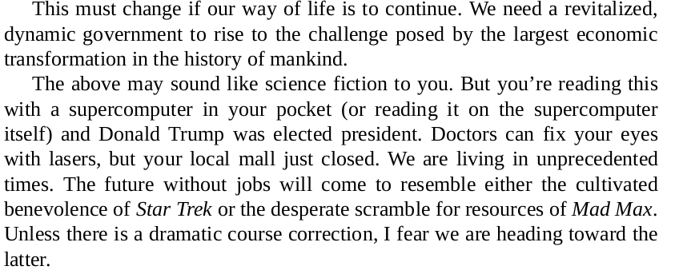
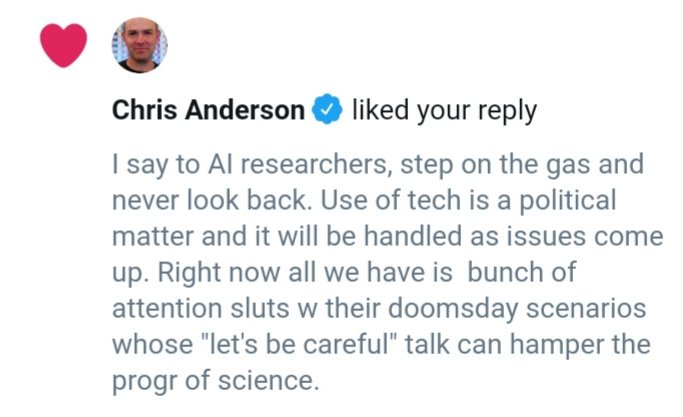

#yang

---

Cuomo saz he'll run if Biden doesnt?.. hmm

Bloomberg is out. Great.

---

Yea - there ain't enough cowshit to fuel such transport (assuming the
translation worked). H2@Scale has the right idea. Everything into H2,
and that into consumption.

"2) biofuel production will not scale to meet the demand ...flying
2-fold by 2030 "

---

This is may be as important as Yang's UBI policy

https://www.youtube.com/watch?v=D9uuOX-Zy0c&feature=youtu.be

---

<blockquote class="twitter-tweet" data-lang="en">
I used to take a victory lap every time one of these stories came out. It felt good to see history vindicate my decision to expose the government&#39;s wrongdoing. Nowadays I just wish it hadn&#39;t taken me so long to speak up. If only I hadn&#39;t been so afraid. <a href="https://t.co/RiVl6cdwlz">https://t.co/RiVl6cdwlz</a>
&mdash; Edward Snowden (@Snowden) <a href="https://twitter.com/Snowden/status/1103072857469403139?ref_src=twsrc%5Etfw">March 5, 2019</a></blockquote>

---

@markrittman

Three months into using a Pixelbook as my main consulting and dev laptop, doing @LookerData + @SnowflakeDB  dev in the cloud and running http://getdbt.com  from the built-in Linux CLI. One-third the cost of an Apple MBP, instant-on and a keyboard you can actually type on

---

But.. but.. I did some space stuff, doesn't the coolness from there rub off on the car stuff..?

No it doesn't, punk. You have to perform equally on both to be applauded equally. 

This guy..

---

Sheeet

---

<blockquote class="twitter-tweet" data-lang="en">
The US DOE has announced $31 million in funding to enable large-scale <a href="https://twitter.com/hashtag/hydrogen?src=hash&amp;ref_src=twsrc%5Etfw">#hydrogen</a> generation, storage, transportation, and utilization of <a href="https://twitter.com/hashtag/H2?src=hash&amp;ref_src=twsrc%5Etfw">#H2</a> energy.  “Hydrogen is an energy carrier that can unite our Nation’s abundant <a href="https://twitter.com/hashtag/energy?src=hash&amp;ref_src=twsrc%5Etfw">#energy</a> resources,” said Rick Perry.<a href="https://t.co/uGzLDEX1gU">https://t.co/uGzLDEX1gU</a> <a href="https://t.co/GbrZAGuvVp">pic.twitter.com/GbrZAGuvVp</a>
&mdash; H2 &amp; Fuel Cell News (@H2NewsGlobal) <a href="https://twitter.com/H2NewsGlobal/status/1102650395015434240?ref_src=twsrc%5Etfw">March 4, 2019</a></blockquote>

---

Geostorm; watchable. I like the "marry her" scene.

---

Bezos really needs to get out of MSM biz. Sell WaPo. Get out.

---

@zuph

me at 19: why would someone with a cool stem degree want to sell kombucha at the farmers market or run a yarn store?

me at 30: ohhhhhhhh

---

Man that H2@Scale news went off in my feed like a bomb. Kaboom!

---

I had seen a co press conference btw Perry and Birol (IEA) earlier. Perry was mega praising Birol, complimenting like mad. I was like WTH? ... WH must have told him so. This announcement makes sense now.

---

<blockquote class="twitter-tweet" data-lang="en">
Hydrogen is an energy carrier that can unite our Nation’s abundant energy resources and the H2@Scale Initiative will help <a href="https://twitter.com/ENERGY?ref_src=twsrc%5Etfw">@ENERGY</a> achieve our goals of strengthening energy security, resiliency, and a strong domestic economy. <a href="https://t.co/yznfIJTUrs">https://t.co/yznfIJTUrs</a> <a href="https://t.co/0W2wsy2Yi4">pic.twitter.com/0W2wsy2Yi4</a>
&mdash; Rick Perry (@SecretaryPerry) <a href="https://twitter.com/SecretaryPerry/status/1102599194064359424?ref_src=twsrc%5Etfw">March 4, 2019</a></blockquote>

---

<blockquote class="twitter-tweet" data-lang="en">
<a href="https://t.co/Wq92hKvb58">pic.twitter.com/Wq92hKvb58</a>
&mdash; Dan Kaminsky (@dakami) <a href="https://twitter.com/dakami/status/1102307931591045120?ref_src=twsrc%5Etfw">March 3, 2019</a></blockquote>

---

