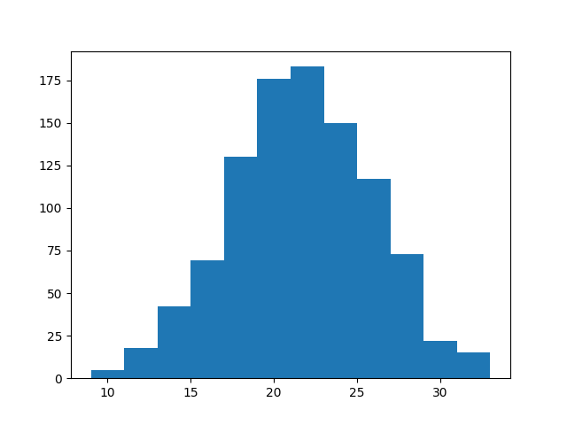
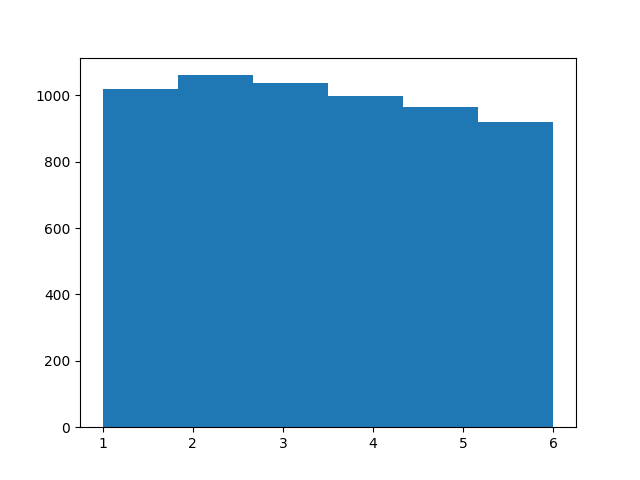

# Week 5

<blockquote class="twitter-tweet"><p lang="en" dir="ltr">The map shows how much tax revenue your country loses from corporations shifting profits to tax havens.<br><br>In total 40% of multinational profits are shifted to tax havens each year.<br>This reduces corporate income tax revenue by nearly $200 billion.<br><br>from <a href="https://t.co/Wa9aVaeikB">https://t.co/Wa9aVaeikB</a> <a href="https://t.co/4Y9HWXsrxj">pic.twitter.com/4Y9HWXsrxj</a></p>&mdash; Max Roser (@MaxCRoser) <a href="https://twitter.com/MaxCRoser/status/1356203389630218243?ref_src=twsrc%5Etfw">February 1, 2021</a></blockquote> <script async src="https://platform.twitter.com/widgets.js" charset="utf-8"></script>

---

By "average" yesterday I meant long-running average between two (or
more) views (cld be immed avg too). One party cld be for 30% tax rate,
another for 70%. Each enact their thing one in power, if they can,
long-running average is 50%.

---

Stiglitz: "Biden’s proposed spending plan is urgently needed. Recently
released data show a slowdown in America’s recovery both in terms
of GDP and employment...

The economy would, of course, be better off without zero interest
rates. It would also be better if policymakers raised taxes by
imposing levies on pollution and restoring greater progressivity to
the tax system. There is no valid reason why the richest Americans
should pay lower taxes as a percentage of their income than those who
are far less well off. Given that wealthy Americans have been the
least affected, medically or economically, by the coronavirus
pandemic, America’s regressive tax system has never looked uglier...

Under President Donald Trump, the programs that focused on small
businesses were not as effective as they could or should have been –
partly because too much of the money went to businesses that were not
really small, and partly because of a rash of administrative problems"

[Link](https://www.project-syndicate.org/commentary/biden-right-to-launch-massive-rescue-plan-by-joseph-e-stiglitz-2021-02?referral=d582d5)

---

"Sumitomo Corporation of Americas Makes Strategic Investment in Hydrogen Fuel Provider OneH2"

[Link](https://www.prnewswire.com/news-releases/sumitomo-corporation-of-americas-makes-strategic-investment-in-hydrogen-fuel-provider-oneh2-301216213.html)

---

"GM partnering with Navistar on hydrogen fuel cell semi trucks"

[Link](https://www.detroitnews.com/story/business/autos/general-motors/2021/01/27/gm-partnering-navistar-hydrogen-fuel-cell-semi-trucks/4265647001/)

---

Podcast from the University of California, Irvine, talking to Jack
Brouwer, a professor of mechanical and aerospace engineering at UCI,
also the director of the National Fuel Cell Research Center, as well
as the director of the Advanced Power and Energy Program.

"It’s much more reliable to have both a renewable fuel and renewable
electricity delivered in society. And we experience that today, for
example, when we have the public safety power shutoff events, and when
we have wildfires that shut electric grids down, or when electric
grids themselves cause fires because they become too overloaded. When
these things happen, we depend upon underground delivery of natural
gas, today. Of course, it’s going to have to be transformed to this
renewable hydrogen vector. And when we put those together, we can
envision a 100 percent renewable world that is also reliable"

[Link](https://news.uci.edu/2021/01/27/uci-podcast-solving-climate-change-with-clean-hydrogen-fuel/)

---

Both shooting, and weight guessing involves knowledge / skill BTW,
very important. Good noise around bullseye means person knows how to
shoot.  Judging weight by naked eye is possible bcz we have innate
knowledge of weights of things, through evolution, and part of growing
up, so the noise is normal. Stat ppl know this, when they apply a
model to data, they determine whether it is good by looking at its
mistake, its "residual" (diff between model pred, and real data). If
resid is gaussian, they are happy. Bad models leave patterns in
data. When unskilled (or dumb) people eff up you know why. There is
pattern in their eff ups (usually due to some bias).

---

Height is normal of course.. many factors contribute to height. Some
ppl might have a fat ass, small back, others large back, skinny
ass. Large or small head.. All cld lead to same height.

---

Anyway; then, if shooting errors, weight guesses are `true value + normal noise`,
averaging removes noise, bcz average of zero-centered
Gaussian (which is noise) is zero. This is the magic.

---

But if I sum every 6 die throws and histogram,

```python
rolls = [random.randint(1,6) for i in range(b*n)]
rolls = np.array(rolls).reshape(n,b)
s = np.sum(rolls,axis=1)
plt.hist(s,bins=12)
plt.savefig('dice1.png')
```



Bell shaped. Normal.

Why? Bcz more sums result in a 6 than 2. I can get 6 with
4+2,2+4,1+5,3+3,etc.. More chance to hit it. Very low, very high nums
are harder. Easy sums form the bulk in the middle.

---

Demo. Throw a 6-sided die 1000 times (numbers below are from software
generator), histogram rolls,

```python
import random
n = 1000; b = 6
rolls = [random.randint(1,6) for i in range(b*n)]
rolls = np.array(rolls)
plt.hist(rolls,bins=6)
plt.savefig('dice2.png')
```



Nearly uniform (not normal), all equal chance,

---

Normal distribution is weird; it shows up everywhere. Take a group of ppl,
their height dist is normal.

Have someone shoot at a target, measure distance from each hit to
bulls eye, dist is normal.

Whenever many factors *contribute* to a thing, normality occurs.. bcz
sums of anything (random) approaches normal. And there are many things
like that in nature

---

To elaborate more on how consensus among (knowledgeable) people can
result in correct decisions.. Remember earlier
[post](../../2020/07/crowd-wisdom.md) at a country fair 800 people estimated
the weight of an ox. Statistician Francis Galton observed that the
median guess, 1207 pounds, was accurate within 1% of the true
weight. Magic.

The reason is, guesses have noise, the right kind of noise, around the
right answer. Averaging removes noise.

The noise distribution is bell-shaped, "normal" or a "Gaussian" (a
dist is the formulaic form of a histogram, occurence count, frequency).

---

Haha.. Robitaille took an ad on *New York Times* about his findings in 2002.
I share it [here](../../2021/01/kirchoff-sun-bigbang.md).

---

I wonder if all that sugar is added to marmalede to increase its
viscosity to add a kind of protective layer against air, etc
influence.. What if u just add olive oil?

---

"@michaeldweiss

Protests continue across Russia today to free Navalny. Video of cops
beating people in St. Petersburg"

[Link](https://mobile.twitter.com/michaeldweiss/status/1355914024328835072)

---

Fast digital payments are a good thing.. But a fiat currency needs the
ability to have its money base expand depending on political
decisions.

---

Hal Finney (so called "Satoshi")'s reasoning for creating BTC was
wrong. He created it in the aftermath of 2008 crisis (his pseudo is
taken after his neighbor's name who lost money during crisis), and
thought "printing money" was the culprit. The problem wasnt printing
money per se, but who it was printed for.

---

BTC is absolutely the expression of the naivete coming from common
tech guy - bright, shiny object loving, unaware of landscape, soc
ecosystem, side effects, etc..

---

Left-leaning econs dislike this thing to a man.

---

In the absence of clear-cut scientific law, differing views surface,
and among enough knowledgable people, their average leads to something
acceptably optimal.

In econ there is division around thriftyness and extra spending (some
research popping up on the question but nothing solid), right and left
have different answers. Fine.

But Bitcoin exclusively chooses one side of that argument, ignoring
the other (money base cannot expand = thrift) hence it takes itself
out of the discussion altogether. A country cannot adapt BTC as
currency bcz of this.

---

<blockquote class="twitter-tweet"><p lang="en" dir="ltr">This problem you&#39;ve been concerned with, that thousands of people have studied for decades and sometimes centuries? It has a simple solution: bitcoin</p>&mdash; Gabriel Zucman (@gabriel_zucman) <a href="https://twitter.com/gabriel_zucman/status/1353189704385011712?ref_src=twsrc%5Etfw">January 24, 2021</a></blockquote> <script async src="https://platform.twitter.com/widgets.js" charset="utf-8"></script>

---

What kind of notation is that? If random, not-referenced-elsewhere
Greek letter is used, you have to assume summation over all indices?
$u_\beta$ means $u_x + u_y + u_z$? WTF? What the actual f--k man?

---

Gerardo Frisina - Bluesanova \#music

[Link](https://youtu.be/9kl3sU_id58)

---

But they love proposing such ostentatious ideas, it makes them sound
smart. Hell one is thinking abt multiple universes.. isnt that smart?

Sadly nah.. I gurantee it a lot of these muckers are extremely
bleeping dumb.

---

Fundam phy is stuck, and they know it. But they mistakenly think more
elaborate ideas are needed to get out of it, enter endless "thought
experiments" on time, universes, determinism, etc. But it is very
possible what they missed is something basic, only two or three steps
ago. They built up all this shit thinking that step was real, so the
fix will involve fixing that error, or creating something more
fundamental than having these "sexy tricks".

---

Started to watch more cable news, this must be return to some kind of normal

---

"@MattZeitlin

wow wonder why VCs and tech execs want no taxes on capital gains, an
expanded market for equities, and short sellers banned and/or jailed"

---


---

Right it'd be pretty stupid if they kept dividing the stock market cap
by the same number, for three months.. Then there'd be no need for
this ratio, you would just look at the market cap value itself..

No they use projected GDP, and apparently take it from the
[GDPNow](https://www.frbatlanta.org/cqer/research/gdpnow.aspx)
estimate of the FED.

"Wilshire uses market cap divided by GDP. But official GDP is released
quarterly? Do they they use that number for this calculation?"

---

Yep; bcz of incompressibility, star cannot collapse on itself, a
black hole cannot form. Years of pondering, books, articles written
assuming BH existence were all worthless. It all goes to the trash.

<iframe width="300"  src="https://www.youtube.com/embed/kI14fpM3ouU?start=333&end=369" frameborder="0" allow="accelerometer; autoplay; clipboard-write; encrypted-media; gyroscope; picture-in-picture" allowfullscreen></iframe>

---

All-around shoot-the-shit is no picnic either, I tell you.

---

Skills to be a journo has to be different than the skills to be an
all-around shoot-the-shit commentator. Lots involved in checking a
story, talking to ppl involved in it, etc right? Lota focused skill

---

*Outside the Wire*, little *Training Day*'ish, but has some solid
anti-militant messages.. The actor with the wing-suit from *Avengers*
was in it. Brother was like the black Terminator!

---

Cutler - Sync Estate \#music

[Link](https://youtu.be/_GLwv4TUGfo)

---

Is this relevant today? Well modernity (the second wave, after the
agro first) added its own mental structures that are in some ways even
more encompassing, and intricate. No wonder many ppl are still
interested in these things.. Zen, Buddhism etc, not to mention other
mainstream religions from the West.

---

I guarantee it Eastern religions, Taoism, Buddhism are a protest
against agro, village societies as well..  These societies constructed
a conceptual world with its idols, worship rituals, rhytms so
ever-present that new religions would rebel against. I bet the Zen
koans are packaged to make zero sense in that frame, to stir shit up
in the mind so that only when that frame is dropped, it makes sense,
or rather, the act of trying to make sense is dropped, hence the
practitioner reaches "enlightment".

---

messaging has been off

<blockquote class="twitter-tweet"><p lang="en" dir="ltr">Always a red flag to me when you claim to be representing the mom and pop investor (especially if you can’t adequately describe what you’re protecting them from)</p>&mdash; Skanda Amarnath ( Neoliberal Sellout ) (@IrvingSwisher) <a href="https://twitter.com/IrvingSwisher/status/1355636735401721857?ref_src=twsrc%5Etfw">January 30, 2021</a></blockquote> <script async src="https://platform.twitter.com/widgets.js" charset="utf-8"></script>

---
