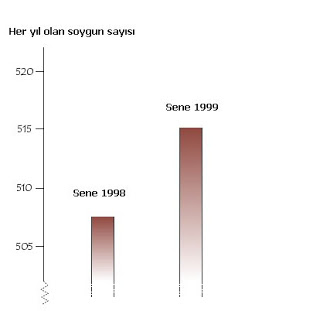
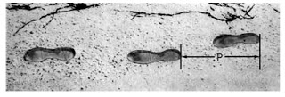
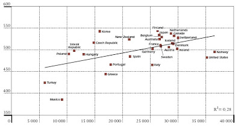
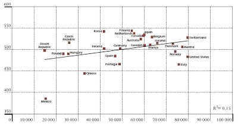

# PISA 2003
PISA, Programme for International Student Assessment, yani "uluslararası öğrenci seviye ölçüm programı" kelimelerinin baş harflerinden oluşan bir kısaltma. PISA, OECD'nin bir alt programıdır, ve 2000, 2003 yıllarında üyesi olan her ülkede 15 yaşindaki öğrencilerin seviyesini ölçüp sonuçlarını rapor etmiştir (program her uc senede olcum yapmaya devam ediyor). Türkiye aktif olarak 2003 ve 2006 sınavına katilmistir. 2003 sonuçları bellidir, 2006'nin sonuçları Aralık 2007'de belli olacaktır.Bizim burada analiz edeceğimiz sonuçları, 2003 raporu temelli. Sonuclarin, verilerle sunulmuş orijinalini burada (PDF - 5.67 MB) bulabilirsiniz. MEB sitesinde de kısa ve pek detaylı olmayan bir analiz mevcut. Biz, her zaman yaptığımız gibi, probleme detaylı verilerle saldırıp, sesi sonuna kadar açmaya çalışacağız.DurumPekalaaa... Nasildir halet-i maarif-i umumiye? "Bizim çocuğun durumu nasıl öğretmen bey?". Çocuğun durumunu söyleyeyim: 2003 itibariyle durumu TKF. Yani Tek Kelimeyle Felaket. Yani, durum gelişmekte olan bir ülke için o kadar rezalettir ki, açıkça söyleyeyim ne yapsak bundan daha kötü olamayız. Hiçbir şey yapılmasa, belki şans eseri ilerlemiş olunurdu; Durum o kadar berbattir. Ya da, 2003'teki durum o kadar diptedir ki, nereye gitsek, yukarı çıkıyoruz demektir. Umarım halimizi tarif edebilmisimdir.PISA testi, her ülkede rasgele seçilen okulların öğrencileri için hazırlanmıştır. Sinavdaki her sorunun zorluğuna ve verilen cevap yeterliligine değişik puan ağırlıkları olabilmektedir, ve bu puanlar en sonda toplanıp öğrenci seviyesi belirlenmektedir. Sınav sonucunda öğrenciler 6 değişik seviyeden birine verilmiştir, 6 en yüksek seviyedir.Sorularin mahiyetini anlayalım diye örneklerini göstereceğiz, fakat bazı ilk rakamları hemen paylasalim. Eğer rapordaki Figur 2.16a'ya bakarsanız, Türkiye'nin ortalama olarak matematikte 40 ülke arasında 35. olduğunu göreceksiniz. Bu kötü ama eğer tüm ülkelerin notları yüksek olsaydı, bu bir anlam ifade etmeyebilirdi. Sonuclarin derinliğine inince, iş daha iyi ortaya çıkmaya başlıyor. Çünkü bilgi ekonomisinde lazım olacak türden düşüncenin varlığını test eden bu sınavda, Türk öğrencilerinin takriben yarısının daha 1. seviyeyi bile gecemedigi belli oluyor! Alarm zilleri çalmaya başladı mi? Calmadiysa, fikriniz olsun diye 1.'yi bırakın, 4. seviyedeki sorulara bir örnek veriyorum:"Televizyon yorumcusu alttaki grafiği gösterdi ve şunu söyledi:Bu grafige bakarsak, y şehrindeki soygunlarda 1998'den 1999'a büyük bir artış olduğunu görüyoruz.Bu yorumcunun söylediklerine katılıyor musunuz? Cevabinizi açıklayın ve destekleyici argümanlar ortaya koyun". Grafige bakıyorsunuz: Y eksenindeki skala 505'ten başladığı için aslında artış fazla değil. Bunu bile söylemek size 4. seviyeye getirecek puan kazandırıyor. Eğer artışın yüzde olarak hesabını yaparsanız, 6. seviyede bir cevap vermiş oluyorsunuz. Peki üstteki sorunun en basit cevabının bile sizi taşıyacağı 4. seviyeye kaç kişi gelebilmis? Ya da kaç kişi gelememis, ona bakalım:Cevap: Türk öğrencilerinin %88'i!Düşünebiliyor musunuz? Adamın en basit grafige bakarak, çok basit bazı sonuçlara bile varamadigi gozukmektedir! Efendim ikna olmadım. Bir örnek daha vereyim."Alttaki resim, bir insanın ayak izlerini göstermektedir. Adım büyüklüğü P yanyana basılmış iki ayak izin arkalarinin uzakligina bakılarak hesaplanmıştır. Erkekler için n/p=140 formülü n ile p arasında bir ilişki kurmuştur, ve "n = bir dakikada atılan adım sayısı" ve "p = her adımın metre olarak ölçüsü'dur. O zaman, eğer Hasan adım ölçüsünün 0.8 metre olduğunu biliyorsa, ve formül Hasan için geçerli ise, Hasan'in metre/dakika ve kilometre/saat olarak olarak yürüyüş hızı nedir?"Bu soru, çok basit bir formuldeki yerlere koyma ve sonucu bulma işlemine bir örnektir. Düşünce çizgisi n / 0.8 = 140 diye başlayacak, sonra n = 140 x 0.8 = 112 olarak devam edecektir. Bu bile sizi 4. seviyeye ulastirmaktadir. Bu ilk çıkan 112 adım/dakika sonucunu, adamın adım ölçüsü bilindigine göre, metre/dakika ve kilometre/saate cevirebilirseniz (ki çok kolaydır) bu sizi 6. seviyeye ulastirmaktadir. Bu soruda matematiksel model oluşturmayı geciniz, mevcut model üzerinden hesap yapmanız istenmiştir. Ve, üzülerek söylüyorum, yuzdelerimize bakılırsa bu soru türlerini 4. seviyede bile cevaplayamayan öğrencilerimizin oranı yukarıda belirtildiği gibidir.Diğer RakamlarPISA sınavında en iyi sonuç alan milletlerin Finlandiya, Çin, Kore ve Kanada olduğu gözükmektedir. Bu ülkeler öğrencilerinin yarısından daha fazlasını 4. seviye ve yukarısında tutmayı basarmislardir. Türkiye'nin ise öğrencisi ağırlıklı olarak 3. seviye ve altındadır. Aslında bu sonuçlar şu anki iş gücümüzün hikayesini de anlatmaktadır. Az sayıda uzman vardır, ve "ne iş olursa yaparım abi" havasindaki insanlar çoğunluktadır. 1. seviyeye bile "gelememis" (yani seviyesiz) insanların sayısının Türkiye'de %27.7 olması durumu pek güzel açıklıyor zannediyoruz! Bu öğrencilerin matematiksel düşüncenin m'sini almamış oldukları ve bilgi ekonomisinde geride kalacakları kaçınılmaz olacaktır. Bizi bu alanda geçen yegane ülkelerin Meksika, Brezilya, Indonezya olması bizi rahatlatmamali.. Yunanistan hem alt seviyelerde bizden az, hem üst seviyelerde bizden fazla öğrenci seviyesi ile bizden daha iyi bir konuma gelmeyi başarmıştır (ama onlarinda yapacak çok işi var tabii). En üst seviyede %2.4 ile ABD'nin %2.1'inden daha iyi bir sonuç almamız güzeldir, fakat ABD'nin 4. ve 5. seviyelerdeki öğrencileri bizden çok daha fazladır, ve en alt seviyelerdeki öğrencileri bizden daha az sayidadir. Yani ufak bir yerde istatistiki eşitlik genele bakılınca olan durumu telafi etmemektedir. Eğitim, aynen sağlık gibi, satha yayılması gereken bir hizmettir - tek tük adamı kurtararak ilerlemek mümkün değildir. Ayrıca Türkiye'nin Amerika gibi dışarıdan eğitilmiş beyinleri "ithal etme" şansı nispeten daha azdır.İlginç bir grafik ise, milli gelir ile PISA sınav notu arasındaki korelasyon (büyük hali için tıklayın):Bu grafige göre kişi başına milli gelir ile PISA başarısı arasında direk bir ilişki (correlation) olduğu gözüküyor. Fakat hemen uyaralim, iki değişken arasında korelasyon olması, o parametrelerden birinin her zaman diğerinin sebebi olduğu anlamına gelmez, belki ortada iki parametrenin dayandığı bir üçüncü parametre vardır, ve korelasyon aslında bu diğer saklı korelasyonu göstermektedir, bu üçüncü korelasyonun olup olmadığı eğitim ve sosyalbilimcilerin işidir, fakat her halükarda, aradaki direk bağlantı dikkat çekicidir. Bu grafige bakarak varilacak bir diğer sonuç, Türkiye'nin milli gelirine oranla hakettiği puanı alamamış olmasıdır (eğer milli gelirin hakettiği sonuç alinsaydi, Türkiye veri noktası çizgiye yakın olurdu), ve belkide bir sonraki grafik bunu aciklamaktadir (büyük hali için tıklayın).Bu grafik her milletin eğitim için öğrenci başına harcadığı para ile PISA sonuçlarının grafigidir, yine arada korelasyon mevcuttur, ve Türkiye (demek ki) harcadığı müthiş cuzi miktar sebebiyle, grafige köşesinden bile dahil olmayı basaramamistir. Yani, hem GSMH düşüktür, evet, ama bir yandan da GSMH'nin gereken oranı eğitime harcanmamaktadir.Final AnalizŞimdi işin yapılacaklar ve sorumluluklar kısmına gelelim. İtiraf etmek gerekir ki, PISA 2003 sınav sonuçlarının sorumlusu AKP hükümeti değil, 2000/1 ve öncesi başta olan hukumetlerdir, ya da daha geniş bağlamda 2003'te 15 yaşında olan çocuğun eğitim hayatı boyunca başta olmuş her milli eğitim bakanligidir. 2006'daki sinavin sonuçlarının sorumlusu olan AKP olacaktır. Bu sonucu merakla bekliyoruz.Milli Eğitim Bakanlığı, PISA sınavına aktif olarak katıldığı, okul seçiminde, sinavlarin tercumesinde yardım sağladığı için sonuçlardan birinci derecede haberdar olmalidir; Önemli olan, bu sonuçlara göre ne kadar icraat yapıldığı/yapacakları, ve ne kadar rota değişikliği olacağı, olmuş olduğu sorusudur.PISA sinavinin ruhu hakkında biraz daha bilgi vermek gerekirse, amaçlarının matematiğin günlük/teknik hayata uyarlanması, okunanin anlanmasi, modelleme, grafik yorumlama, veri analizi gibi modern ekonomide lazım olacak konular olduğundan bahsetmiştik. PISA'nin yapmadığı, matematik derslerinde çoğunlukla yapılan "f(x)'in turevini al" gibi mekanik, artık bilgisayarların (bile) yaptığı sorulardan kaçmak, bundan ziyade, hiçbir metot ve mantık zinciri "rengini belli etmeden" sadece teknik bir sorunun, bir şekilde, kullanılabilir bir teknik cevabını beklemektir. Bu mentaliteyi mastır öğrencileri için en güzel GRE sınavı test ediyor. Hele hele grafik analiz, korelasyon görme, modelleme gibi konuların üstüne ne kadar bassak az olur. Bu konu (modelleme hariç) daha yüksek seviyede GRE tarafından çok güzel şekilde test edilmektedir.Mufredat gelistirmesinde, eğer hala yapilmadiysa, OECD ile ortaklık muhakkak faydalı sonuçlar doğuracaktır. Bunu yapan pek çok (hatta gelişmiş) ülke mevcuttur. Herhalde bizde de üniversite sinavlarindaki soru tiplerinin değişmiş olmasının sebebi PISA sonuçları idi, inşallah bunun meyvelerinin 2006 yılındaki sınavda göreceğiz.Ayrıca, daha ilerisi için, mufredatlarda yetenekli öğrencilere daha fazla seçenekler, "illa analiz (calculus)" yerine daha geniş yelpazede matematik - lineer cebir, olasılık ve istatistik gibi konularının tanitilmasinin gelecek nesil yeni ekonomi çalışanları için faydalı olacağını zannediyoruz.Ilgili yazi: PISA 2006, Endustriyel Ideolojilerin Temelleri

zaman:

Ocak 28, 2007

