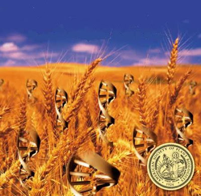
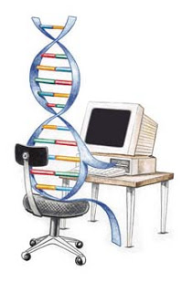

# Ek Noktalar IV
* Fosil yakitlari uzerine kurulu Bush'un Ortadogu politikasi, bu yakitlardan en   buyuk cikari olan lobilerin kuvveti surdugu surece degismeyecektir. Ucuncu   dalgayi kismen temsil eden ama hala ikinciyi de bir sekilde memnun etmeye   calisan Hillary Clinton kazanirsa, bu sebeple ana politikalarda degisiklik   olmayacaktir. Israil/Filistin cozumu icin "cok ugrasan" kocasi da, Filistin   tarafindan Israil yanlisi bulundugu (ve oldugu) icin sonuca ulasamamisti - bu   Arafat'i aslinda gayet basarili 2. intifada hareketini baslatmaya itti. Buna   karsilik Arafat'i oldurtup, yerine gecen Abbas'a secim icin bastiran   Israil/ABD, bu yolla bugunku bolunmenin de temelini atmis oldular.Ortadogu'ya uygulanan su anki sablon, tum karisikliklarin ABD ve Suudi   Arabistan'dan uzak tutulmasi, boylece petrolun kesintisiz bir sekilde   Amerika'ya ulasmasidir.* Eski endustriyel mentaliteye sert bir donusu temsil eden Bush hukumeti, kendi   karanlik entegrator elitini tekrar devreye sokunca, buna karsilik diger   devletlerin genetik hafizasinda olan elitlerarasi kapismayi da tekrar gundeme   getirmistir. Entegrator elit, daha once bahsettigimiz gibi, birlestirmek ister   bu amacla diger ulkelerdeki elitlere "uzanir". Ama iki ulke elitlerinin   cikarlari birbirine uyusmaz ise, birlesemezler, fakat sanayi illa birlesmeyi   gerektirir, bu sefer bunu baska yolla yapmak ister ve savas   basgosterir. Fransa ve Almanya entegrator eliti politik olarak birlesemedigi   icin savasmisti - Almanya'nin savastan once ticaretinin en yogun oldugu ulke   Fransa'ydi.Son zamanlarda Rus ve ABD arasindaki elit kapismasinin bu sekilde gundeme   gelerek tekrar "hatirlandigini" goruyoruz, burada suc hala dunyaya ikinci   dalga mentalitesinden bakmakta israr eden Bush hukumetidir.* Urdun ve Misir'da bilgi/servis ekonomisi yonunde kipirtilar olmaktadir. Bu   devletler bu yonde ilerleyebilirlerse, hatta ileride sorunlarini halletmis   Filistin ve Israil'i de yanlarina alabilirlerse, yeni bir high-tech guc kusagi   olusturmalari mumkundur.* Yenilenebilir enerji standart tarim uzerinden elde edilebilir, ama daha ilginci (belki de daha iyisi) biyoteknoloji teknikleri   ile yapay olarak yaratilmis bakterilerden de elde edilmesidir. Mesela hidrojenin bu   sekilde yapay hucrelerden bol miktarda islettirilip enerjiye   donusturulmesi konusunda arastirmalar yapilmaktadir.* Biyoteknoloji, ileride bilgisayar programciliginin biyolojik kuzeni haline   donusecektir. Bu sekilde yapilan programcilik bugunku IT   programciligi gibi yaygin bir meslek haline gelebilir. Tarim, enerji, ve cevre   acisindan bu tur kodlama ile gozde bir meslek haline donusecektir. Karbondiyoksit alip   oksijen uretebilen bir yapay bakteriyi "programladiginizi" dusunun, ya da mevcut bir bakteriyi alip biyolojik programini daha verimli hale getirmeyi. Diger bir ornek, bir proje baglaminda, cok sicak ortama dayanabilen bir   misir cesidi "programlanmasi" olabilir. Kuresel iklimin gittigi yone bakilirsa, bu yakinda pek anormal bir ihtiyac sayilmayacaktir.Ucuncu dalganin onemli bir bacagini temsil eden biyoteknoloji alaninda arastirmalarin arttirilmasi had safhada onemlidir. Israil bu alanda oldukca asama kaydetmistir - mesela ulkemize   ihrac ettikleri genetik olarak degistirilmis bir domates cesidi, kendi meyve   vermekte, ama genetik degisimi sayesinde/yuzunden tohum olarak kullanilamamaktadir. Bu   sayede bu tur domatesi daha fazla ekmek icin surekli Israil sirketine tohum   icin geri gidilmesi saglanmistir.* Biyoteknolojik programciligin tarim alaninda "bir is" haline gelmesi, bu tur programcilara ihtiyac duyacak biyo-tarim sirketlerinin olusmasi sayesinde mumkun olur. Bu biyo-tarim sirketleri ise urettikleri urunu ya bir ciftciye satacak, ya da kendi sahip olduklari genis topraklarda kendi uretimlerini optimize etmek icin kullanacaklardir.Bize gore boyle bir ARGE'nin kullanicisinin buyuk toprak sahibi buyuk biyo-ciftci olmasi en isabetlisidir. Yatirim, belli miktarda bilincli risk almayi bilebilecek bu tur akilli biyo-ciftcilerin varligi, diger yandan topraga ailesel ve buyuk sayilarda bagli birinci dalga toplumunun olmesini de cabuklastiracaktir. Boylece birinci dalga tarim, yerini ucuncu dalganin fikir yogunluklu tarimina birakir.Ayrica ekim, hasat, bakim gibi rutin islerin otomize edilebildigi oranda bu tur tarimin "sanayilesmesi" de engellenmis olacaktir. Uydu bazli meterolojik izleme, gelismis sensor ve kontrol aygitlari ile her toprak kesitine ayri bakabilen bu tur sistemler, ikinci dalganin "toptanligi" yerine ucuncu dalganin ozel bakim (customization) zihniyetini getirecektir.* Insanoglu bitkileri genetik olarak programlayabilecegi gibi, yakin bir zamanda kendini de "tekrar programlamayi" hedefleyecektir. Bunu olumcul bir hastaligini tedavi, ama ayni zamanda normal bir yetenegini "arttirmak" icin de kullanmayi secebilir. Bu "kendini biyolojik olarak degistirme" istegi, simdiden bisiklet, atletizm ve Olimpiyat Oyunlarinda iyice kendini belli etmeye baslamistir cunku suratle gelisen biyolojinin mumkun kildigi performans arttirici ilaclarin cesitlerinin artmasi, onlari kontrol etmeyi iyice zor hale gelmistir. Tipik bir silah/kalkan yarisi olarak gozukebilecek bu oyun, ne yazik ki yine akimlarlarasi bir cekismeyi temsil etmektedir, ve bu cekismede kaybeden kacinilmaz bir sekilde "merkezi kontrol" olacaktir. Insanligin evrimi onu kendini biyolojik olarak degistirebilme yonundedir ve hicbir kontrol bu istegin onunde duramayacaktir. Gunun sonuda Olimpiyat oyunlari bile kistaslarini degistirip insanlarin degil "en iyi ilaclarin" kendilerini yaristirdiklari bir alan haline gelebilirler.* Biyoteknolojide cok ileride olan ABD, bu pozisyonu hakkinda simarmamalidir - cunku kok hucre arastirmalarina dini hassasiyetleri sebebiyle engel koymayi secmislerdir (bu, dinin kendine gore yorumlaridir tabii, cunku mesela Bush hukumetinden daha fazla dinci olan Iran rejimi kok hucre arastirmalarina engel koymamistir) ama biyoteknolojiye hicbir sinir koymamis olan Cin, her alanda arastirmalara tam gaz devam etmektedir.* Temiz enerji biyolojik olarak uretilebildigi gibi, dunya disi kaynaklardan da   alinabilir. Ay uzerinde bol miktarda olan helium-3, bir hidrojen isotopu   (deuterium) ile birlestiginde ortaya muthis bir enerji cikmaktadir - 25 tonluk   helium-3 ABD'ye bir sene yetecek elektrik enerjisi uretme kapasitesine   sahiptir. Ay'daki helium kapasitesi dunyadaki tum fosil yakitlarinin   enerji kapasitesinden 10 kat daha fazladir.* Ayrica bir onceki kalemde belirtilen durum, uzay arastirmalarinin ne kadar   onemli oldugunun bir gostergesi daha sayilmalidir. Dandik bir uydu atmak bile   ulkemiz icin bir "ilk basari" olma acisindan cok onemli bir basamak   olacaktir (Turkiye'deki bir istasyon ve Turkiye'de imal edilmis bir roket ile)

zaman:

Haziran 22, 2007

