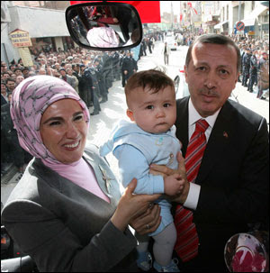

# YDB - 7/3
Tayyip ErdoganDünya Kadınlar Günü nedeniyle Uşak’ta düzenlenen toplantıda konuşan Erdoğan, kadınlara “Bunlar Türk milletinin kökünü kazımak istiyorlar, nüfusun azalmasını istemiyorsanız, 3 çocuk doğurun” dedi.DogruYani, 3 cocuk kismi dogru... Ama daha kesin bir sayi istiyorsaniz, her ailenin 2.1 cocugu olmalidir! :) Bu rakam gelismis ulkelerde (biz daha orada olmasak ta) nufusun saglikli devri-daimi (replacement) icin gereklidir.Bu rakam ile ABD'de bazen dalga gecilir - "evet, evlenecegim, suburbia'ya [1]  tasinacagim, ve 2.1 cocuk sahibi olacagim" bunlardan biri..Serdar TurgutDaha önce söyledim; ‘getir göster bir birinci sayfa manşetini ve buyur ulusalcılık de’ diye ama o başka yazarların köşe yazılarıyla münakaşa ediyor kendi kafasında.YanlisBahsedilen gazetede "darbecilik kotu bir sey degildir" kivaminda yazilarin ciktigi oldu. Sn. Turgut bunlardan haberdardir umuyoruz... Kendi gazetesini okuyor olmali.---[1] Suburbia, "sehir disi" yani "suburb" kelimesinin bir espriyle ulke ismi gibi kullanildigi bir durumdur cunku sehir disi yasayanlar bazen degisik bir ulkede yasiyor gibi olurlar. Mesela bu sebeple suburbia'nin krali olan New Jersey'den gelen okuldan tanidiklarimiz New York'u hic sevmez. Sevmemezlik ters yonde de isler tabi - NY da NJ'yi pek tutmaz. NJ'in halini en guzel Sopranos dizisinde gorebilirsiniz.

zaman:

Mart 07, 2008

