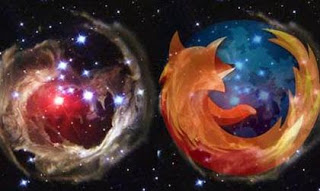

# YDB - 14/4
MilliyetWeb browser'ı Firefox'un ünlü logosunun arkasındaki sır çözüldü. 17 Aralık 2002 tarihinde Hubble Uzay Teleskopu tarafından çekilen bir uzay fotoğrafı akıllara Firefox'un logosunu getirdi.YanlisKimin aklina getiriyor? Hangi kaynaga gore bunu akla getiriyor? Firefox logosunun ortaya cikisi hakkinda gercekleri o logoyu yaratanin kendi agzindan ifadelerle surada bulabilirsiniz. Zaten logoya biraz yakindan baksaniz, onun "dunyayi sarmalayan ates (fire) kuyruklu bir tilki (fox)" resmi oldugunu gorebilirsiniz. Biraraya koyalim: Fire..fox. Capisci? Bakin solda kafasi var, sarmaladigi "seyin" rengi mavi, bir kure (yani dunya), uzerinde kitalar falan gozukuyor yahu!Sanatcinin bu imaji yaratirken esinlendigi "esas goruntu" alttadir. Tek bir Google aramasi ile bu bilgilere 2 dakikada ulasabilirlerdi - "firefox logo icon" kelimeleri yeterli. Geri gelen sonuclarda (hits) en ustteki  bilgiyi veriyor.Gazetelerimiz bu tur haberleri yayinlamadan once bir bilene danisirsa insanlara yanlis bilgi vermekten kurtulacaklardir. Lutfen, biraz kafa ve parmak calistiralim.Mehmet BarlasBizim petrolümüz veya doğal gazımız yok. Bizim bu coğrafyadaki en büyük doğal zenginliğimiz "güvenilir ve istikrarlı demokrasimiz"dir.EksikSn. Barlas bu soyleminde Polonya basbakani Donald Tusk'tan "esinlenmis" (simdi gencler buna "Indra Gandi yapmak" diyor galiba :)). Fakat  Polonya basbakaninin  kendi ulkesi icin soylediklerinin Turkiye icin birebir gecerli oldugunu, kelimesi kelimesine soylemek zor. Soylesiyi okursaniz basbakan "bizde turizm yok, hi-tech yok" diyor. Bunlardan birincisi bizde var, ikincisi de kesinlikle ulasabilecegimiz bir hedeftir. Ozgurluk lazim degil demiyoruz, dogal kaynak kelimesi hafiften acaiptir... Bizce, ozgurluge bilgi ekonomisinin "vazgecilmez/tetikleyici ogesi/arka plani"  olarak bakmak daha dogru.. Bilgi ekonomisinde gercek hammadde, dogal kaynak, bilginin ta kendisidir. O hammaddeye erisim, isleyebilme, vs. baglaminda ozgurluklerden bahsedilebilir.Ve bu baglamda ozgurlukler kesinlikle buyuk onem tasirlar.

zaman:

Nisan 14, 2008

