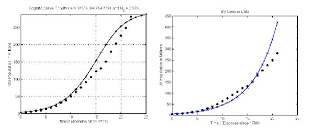
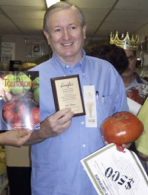
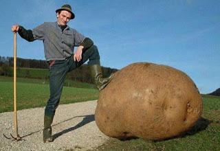

# YDB - 21/4
Erdal SafakMalthus daha o çağda (200 yıl önce) nüfus ile besin maddelerinin farklı dizinde çoğalmalarını dengeleyen savaş, salgın hastalıklar gibi "doğal" nedenlerin, bir yandan uluslararası ilişkilerdeki gelişmeler, bir yandan da tıbbi, biyolojik, kısaca teknolojik buluşlar sayesinde etkinliğini yitirmesi sonucu insanlığın eninde sonunda "beslenme krizi" ile karşı karşıya kalacağını iddia ediyordu. [..] Evet, dünya nüfusu artıyordu ama teknolojik devrim sayesinde, tarımsal üretimde dünya nüfusunu besleyecek düzey yakalanmıştı. Meğer hayalmiş.Yanlis 1) Malthus bahsedilen felaket tahminini 18. yuzyilda yapti, arkasindan 19. ve 20. yuzyillarda onun bekledigi felaket ortaya cikmadi cunku endustriyellesme verimliligi arttirarak besin uretimini arttirdi. Demek ki teori cuvalladi. Eger "ama yeterince bekleyince denklem dogru cikiyor" derseniz, buna bilimsel dangalaklik denir. Durmus saat bile gunde iki kere dogru vakti gosterir. Evet yeterince beklerseniz, bir sure icin herhangi bir denklem herhangi bir konuyu kisa bir sure icin aciklayabilir - ama bunu tutarli, surekli ve uzun vadeli yapabiliyor mu? Surekli kendimize sormamiz gereken soru budur.2) Malthus'un nufus buyumesini gosteren matematiksel bir denklemi de vardir, fakat cok ilginctir ki bizzat kendi one surdugu yiyecek sIkIntisi, hastaliklar gibi kisitlayici sartlari bu denkleme almamistir. Bu sartlarin denkleme eklenmesi icin 19. yuzyilda Pierre Francois Verhulst'u beklememiz gerekecekti. Verhulst daha once bu blog'da isledigimiz logistic fonksiyonu kesfeder ve nufus hesaplari bu ek ile veriyi daha iyi aciklmaya baslar.Malthus tahminleri ile logistic tahminleri yanyana plot edin, bir sure sonra Malthus'un cuvallamaya basladigini, ama logistic fonksiyonun dogru tahmine devam edecegini goreceksiniz (bkz alttaki plot'lar - soldaki logistic denklem)Bunu bir not olarak dusmek istedik, Safak'in ana soylemi ile ilgisi yok, fakat Malthus'un eksikleri ile bir ilgisi var.--Ozet olarak: Nufus artisi kendi kendini besleyen bir dinamige sahiptir, 19.,20. yuzyillarda bu kendini besleme "endustriyellesme" uzerinden olmustur, insanoglu yeni bir uretim sekli kesfetmistir ve kendini daha iyi besleyebilmistir,  simdi de bu biyoteknoloji, otomize tarim gibi innovasyonlar uzerinde olacaktir. Genetik bazi kodlari degistirerek kafaniz kadar domatese sahip olabilirsiniz.Bazi ornekler:Capisc?

zaman:

Nisan 21, 2008

