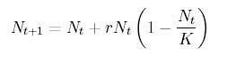
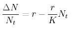

# YDB - 6/4
MilliyetTürkiye İstatistik Kurumu (TÜİK) 31 Aralık 2007 tarihi itibarıyla adrese dayalı nüfus kayıt sistemiyle Türkiye nüfusunu 70 milyon 586 bin 256 olarak saptarken, [..] gibi uluslararası kuruluşlar içinde bu rakama en yakın tahmin Amerikan Sayım Bürosu’ndan (US Census Bureau) geldi. [..] Başta Amerikan Haber Alma Teşkilatı (CIA) olmak üzere çok sayıda kuruluşun rakamlarını kullandığı Amerikan Nüfus Bürosu, 2007 temmuz ayı itibarıyla verdiği 71 milyon 158 bin 647’lik nüfus rakamıyla, Türkiye nüfusunu en iyi tahmin eden kuruluş oldu.Zor bir sey degilBahsedilen hesap, differansiyel matematikte yapilan en basit hesaplardan biridir. Temeli lojistik denklem denen bir modele gider - bu modelin ortaya cikarilmasinda cok guzel bir yaraticilik ve zeka var, ona ileride belki geliriz, ama denklemi biliyorsaniz, ki nufus hesabinda lojistik denklem kullanildigini akademide herkes bilir, tarihi (historical) veriye bakarak ileri dogru tahmin (projection) yapmak cok kolaydir. Once lojistik denkleme bakalim:Bu denklemde sabit degerler r ve K degerleridir, Nt ise donemlik nufus degerleri. Nt degerlerini veriden gelecek, sabit degerleri tarihi veriyi isleyerek bizim cikartmamiz gerekiyor. Burada hemen bir matematiksel takla atmak lazim.Eger Nt'yi sol tarafa alip, iki tarafi Nt ile bolersek elimize dogrusal denkleme benzeyen bir sey gelecek.Yani denklem y = mx + c denklemine benzeyecek, c bizim r, m yani egim (slope) bizim -r/K oluyor. Guzel.Simdi sabitleri veriden cikarmaya gelelim. Ustteki gibi bir denklem kullanarak veriyi ona uydurup (fitting) m ve c degerlerini bulmanin yoluna lineer cebirde "regresyon" denir. En baz matematik paketinde bile bunu yapan bir fonksiyonu bulabilirsiniz. Biz Python Numpy diye bir paketteki polyfit adli fonksiyonu kullanacagiz. Bu arada hemen Turkiye'nin nufus verisini ekte verelim (TUIK'ten indirdik)1940 178211945 187901950 209471955 240651960 281601965 318381970 354641975 395851980 441051985 493991990 541301995 588642000 636272005 68143Bu veriyi nufus.txt diye bir dosyaya kaydedin. Simdi Python bilgisayar programini verelim:from pylab import *pdata = loadtxt('tr.txt')pdiff = diff(pdata[:, 1])pratios = pdiff / pdata[0:-1, 1]p = polyfit(pdata[0:-1, 1], pratios, 1)r = p[1]K = -r/p[0]prev = pdata[-1,1] # en sonuncu veri noktasini alprevy = pdata[-1,0]for i in arange(4):   curr = prev + (r * prev)*(1-(prev/K))   curry = prevy + 5   print(curry, curr)   prevy=curry   prev=currBu kadar!Bu programi islettiginizde elinize gelecek sonuc 2005 yili icin 69,563,000 degeridir.Yukaridaki kodda ekrana basmak icin kullanilan kodlari gecerseniz, gercek hesabi yapan bolumler 7-8 satirdan ibarettir. Yani demek istedigimiz gazeteler bilimsel konularda allama pullama yapmadan once bir biline danisirlarsa, bilgilendirici ozelliklerini arttirabilirler, onemsiz seyleri insanlarin gozunde buyutmekten de kurtulurlar. Ustteki hesap herhangi bir universitede matematik ogreten bir hocanin uykusunda cevaplayabilmesi gereken bir sorudur.Tayyip ErdoganBazıları rahatsız oluyor, Başbakan 3 çocuk yapın dedi diye. Şu andaki nüfus artış oranıyla devam edersek, 2037'de nüfusunuz yaşlı nüfus haline gelecektir. [..] En az 3 çocuk yapın.Hala dogruDaha once belirttigimiz gibi, bahsedilen rakam dogru. Saglikli nufus buyumesi icin gelismis ulkelerde aile basina 2.1 cocuk, gelismekte olan ulkelerde 2.5 ile 3.3 cocuk arasi gerekir (gelismekte olan ulkelerde daha fazla olum oldugu icin). Bu rakamlari, mesela 2.5'i, "genel (blanket)" beyanlar yapmak zorunda olan basbakan gibi biri 3'e dogru "yukari" yuvarlayabilir. Beyan, matematiksel olarak dogrudur.

zaman:

Nisan 06, 2008

