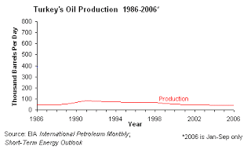

# YDB - 18/6
Yigit BulutPetrol 135 dolar, Türkiye�de neden hâlâ çıkmıyor!Petrol yok demek kiAlttaki grafik Turkiye'nin petrol uretimini gosteriyor (kaynak). Yine bir can egrisi (bell curve)...  Egriye gore Turkiye uretimi coktan tepeyi bulmus (89-94 civari) ve sonra dususe gecmis (bazen tepe noktasi sivri degil duz -plateau- olabilir). ABD, Teksas, Norvec'te dogru tahmin yapan modele inaniyorsak, o zaman diyebiliriz ki Turkiye topraklari icinde petrol beklemek hayal olacak. Cunku bu isin dinamigine gore kolay kuyular hemen aciliyor, oradaki uretim tepe yaptiktan sonra daha zor kaynaklarda uretim asagi gidiyor. Ayrica petrol cikartirken tek sorun o petrolun cikartma "bedeli" degil - (o da onemli, fakat) varil basina daha fazla zaman harcamaniz gereken cetin dogal durumlar da var. Her yerden cikan petrol ayni kalitede degil ayrica, mesela Hazar denizi etrafindakiler sulfuru cok yuksek kaynaklar. Bu daha fazla islem yapmak demek.Bizim can egrisinin ilginc (ve komik) bir sekilde yassi olduguna isaret etmek istiyorum. Petrol fakiri bir ulke oldugumuz bu "yassiliktan" apacik belli oluyor. Tepe noktasi bile neredeyse tepe sayilmayacak ve gorulmeyecek kadar altta. Hayiflanmaya gerek yok, Osmanli parcalanirken alttaki grafigin boyle olmasi neredeyse garantilenmisti zaten.Not: Avrupa'da en yuksek benzin fiyatlari bizde, basinda bu yonde cikan haberler dogru (kontrol etmeden artik boyle basit haberlere bile inanamiyoruz), TR benzin fiyatlari suradan ve AB fiyatlarini suradan alalim: Son fiyat 3.53 lira/litre = 3.53 * (1/1.9 Eur)/litre = 1.85 Eur/litre. Yunanistan Mayis 2008'de benzin icin 1.22 eur/litre odemis. Norvec AB'de en yuksek bedeli oduyor. Onlarda petrol uretimi vardi, fakat coktan tepe yaptilar ve su anda dususu yasiyorlar (kaynak). Grafik altta.Cengiz CandarFatih Terim’in sürekli kendisini aşmaya çalışan, sürekli “çıta yükselten” bir “birey” olduğunu –altını çiziyorum “birey”- fark etmiş ve kendisine bu nedenle sempati ve saygı duymaya başlamıştım. [..] Kimisine, kabul edilmez ve küstahlık gibi gelen özelliği, tam da “vasatlığa”, Türkiye’de çok revaçta bulunan ve derhal ödüllendirilen “mediokrite”ye ters düşen “meydan okuyucu” yanı ile, yani “birey” olmasıyla ilgilidir. [..] Fatih Terim [..] onların “mediokr”luklarına sürekli ayna tuttuğu için, öylelerine düşmandırlar.[..] İddialı, yaratıcı, komplekslerinden arınan, mediokriteye düşman, hırslı bir “birey”... Bütün bu yönleri, başta “hırsı”nın kimi zaman “keskin sirke küpüne zarar verir” özdeyişini doğrulayan görüntülere bürünmesi, onun yanlış biçimde “ultra-milliyetçi” gibi algılanmasına yol açtı. Bu yanlışlığa, geçenlerde Der Spiegel dergisiyle bir futbol söyleşisi yapan Orhan Pamuk da düştü.DogruCan Dundar Orada Türmen “yeni bir toplumsal sözleşme” ihtiyacına dikkat çekiyordu. “Herkesi daha fazla içine alan, asgari müşterekleri daha fazla ortaya koyabilen” yeni bir sözleşme, “kimsenin birbirinden kuşku duymadığı daha başka bir dönem”in kapısını açabilirdi. Türmen, bu “sözleşmenin formülü”nü şöyle açıklıyordu: “Birincisi, herkesin kendi cemaatinin dışına çıkıp düşünmesi gerekiyor. Bu, tüm tarafları kapsıyor.Dogru, ama...Cemaatinden cikiyor iste kardesim, universiteye girmeye calisiyor, ama sen ona "gelemezsin" diyorsun! En azindan "oldugun gibi gelemezsin" diyorsun, bu da yeni cagda "gelme" demekle esdegerdir.21. yuzyilda insanlarin gruplasmalari artik endustriyel cagdaki gibi "aidiyet" merkezli degildir. Sirketinin rozetini yakasina takacak, onun istedigi "her sey" olacak, "organizasyon adami" haline gelecek. Bu devirler bitmistir. Artik sirketler, kurumlar surekli degistirilen, degisen, ve uyelerine "gelisme firsatlari" taniyan calisanin pesinde kosan yerlerdir. Bunun sebebi yeni iscinin fazlasiyla degerli ve el ustunde tutulan bir "kaynak" haline gelmis olmasidir.Bu cagda yeni iletisim gruplasma metotu, "network" kurma uzerinedir, aynen Facebookta, MySpace'de kurdugunuz turden. Bu tur network'lerde kendiniz ile benzer ilgileri olanlar ile bir birliktelige girersiniz, bu birliktelik icin tum benliginizi "degismeye" ugrasmazsiniz. Yeni cagin getirdigi pek cok bilinmezlik, gecicilik, vs. zaten vardir, tum bunlarin ortasinda birey, degismeyecek bir seyleri yaninda tasimak, benliginde tutmak isteyebilir. Bunlara izin vereceksiniz.Su ekmek yeme konusuna gelirsek (yaziya baglantidan giderseniz en basta): Yani, aktarilan AKP hikayesinin dogru olup olmadigini bilemem, ama laikci/karsi catismasindan esas CHP ekmek yiyor olabilir. ABD politikasinda "ayirici konu (vedge issue)" denen bir kavram vardir, CHP ayirici konusu laikciligi kaybetse, mobilize olup CHP'ye kim oy verir ki? Kemalist bir takim gazeteler gazete satabilirler mi?Tum bunlar bir yana: Aslinda turbana izin vermemek daha vahim bir merkezden de geliyor olabilir.Nufus artisinin modelleyen denklemde, catismalarin ortak kaynaklara olan yaris sonucu artabilecegini aktarmistik (hatta bunun sonucu nufus azalmasi bile olabiliyordu). Eh, yeni bilgi ekonomisinde egitim, aynen yiyecek, su, enerji gibi bir "ortak" kaynak ise, su anki TR sartlarinda arzin durumu ortadada. 2008'de 1.5 milyon kusur ogrenci sinava girmis, bunlarin 1 milyon kadari acikta kalacak. Yani onumuzde belli miktarda olan bir pasta var. Laikciler soyle bir hesap yapiyor olamaz mi - "ne kadar az kisi universiteye girebilirse, benim cocugumun sinavi kazanmasi sansi bir o kadar yukselir". Yani talepte azalmayi zorlayip, cat diye kendi sansini arttiriyor. Esit bir sinavda kendi sansinin olabilecegini niye dusunmuyor? Yani, bu adamlarin sacma sapan paranoyalari var, ne bileyim, "bunlari ozellikle hazirliyorlar" filan gibi (bir ara askeri okullar icin bunlari geveleyip dururlardi). Yani sebep, ortak ve sinirli bir kaynaga olan yarisin dogal sonucudur belki de.Cozum? Pastayi buyutmek bir cozum olabilir. Nasil? Mevcut universitelere bilgisayar bazli uzaktan egitimin (acik ogretimden fersah fersah ileride bir duzenden bahsediyorum) mecbur tutulmasi mesela, ve bu egitimden alinacak diplomanin sinifa giderek alinan diplomaya esit tutulmasi. Yani kimin uzaktan kimin yakinda mezun oldugu diplomadan belli olmayacak. Zaten sistem ikisinine de saglam egitim vermek icin duzenlenecek. Bunun ornekleri var, bakiniz Columbia CVN programi, ya da Stanford SPCD programi. Adam Japonya'dan ABD'ye ayak basmadan kapi gibi Columbia diplomasi alabiliyor artik.Tabii bu cozum, sorunun ilk kaynaginin utanc verici halini temizlemiyor. Zenciler hala otobusun arkasinda otursun diyoruz, ama otobusun arka tarafini oyle buyutuyoruz, ki arkada oturan bazilari artik ortada, "hafif one yakin" oturuyormus hale geliyor.Durum budur.

zaman:

Haziran 18, 2008

