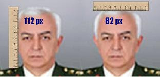

# Brekisefal Degil
Org. Kosaner malum devir-teslim toreninde bizi pek derin felsefi gorusleri ile aydinlatti. Madem ulusalci ideolojiyi bu kadar hatmetmis, etnikcilikten, cemaatlerden bahsetmis, kendisi acaba bir diger 1930 model dusunce olan Turk Tarih Tezi (TTT) hakkinda ne dusunuyor?TTT'ye gore Turk'lerin brekisefal (bir kafatasi sekli) yapisinda olmasi gerekir, yani kafatasinin eninin boyuna olan orani 0.85'ten daha yuksek olmalidir. Piksel bazinda bizim yaptigimiz olcumlere gore Kosaner, enine 82 px boyuna 112 px olculerde ve bu iki olcumun orani 0.73 cikiyor. Yani bu olcumlere gore ve TTT'ye gore Sn. Kosaner Turk degil.Neyse: Bu sacmaliklar tabii ki bizim umrumuzda degil. Bizce, bir insanin isinde yukselmesi icin tek onemli kistas meritokrasidir yani o kisinin kabiliyeti ve becerisidir. Sn. Kosaner iyi bir asker ise, hangi etnik, dil, dinden olursa olsun, onun yukselmesini destekleriz.Ama bir sartla: Isinin gerektirdigi sinirlar icinde kalacak. Eger disisleri, icisleri, siyaset, felsefe alanlarinda at kosturmak istiyorsa, sunu bilmelidir ki, Turkiye'de bu konularda artik onu bese katlayip, dorde carpacak adamlar vardir. Herkes kendi isine bakmalidir. Kimse kimseyi gerici bir takim fikirler baglaminda bir takim kutulara sokmaya kalkmamalidir.Yoksa birisi gelip, sizi de bir kutuya tikiverir.

zaman:

Ağustos 31, 2008

