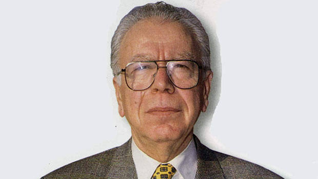

# Kose yazisi

Araya KAYNAR

Son zamanlarda kargasa ve karmasa goruluyor. Herkes olanlara bir sebep
ariyor. Ben ortadan, alttan, ve ustten eszamanli olarak yaklasarak
yeni olusuma bir model cikartmaya ugrasiyorum. Buna sag, sol, penalti,
gol modeli diyorum.

Herkesin beklentilerini soyle formullestirebiliriz. Dis gucler. Ulus
devlet ve ulusotesi futbol kulupleri arasinda bir bilek guresine sahit
oluyoruz. Herkes olaylarin kendi lehine gozukmesini istiyor ve
mutfakta ona gore yemek yapiyor. Ben ana yemekler yerine aperatifleri
dusunuyorum. Rus salatasi mi, Amerikan salatasi mi? Operasyonlar bu
sekilde planlaniyor. Kimse sormuyor: "bu olanlar kime yarar?",
"enistem beni niye optu?". Belki o sabah iyi bir tras oldun, ondan
optu. Bunu kimse dusunmuyor.

Soguk Savas doneminde sag sola, sol saga donuk istihbarat
toplardi. Artik sol soldan, sag sagdan istihbarat toplamaya
basladi. Bu karisik bir durum. Yani iki taraf ayni taraf. Benim bile
kafam karisti. Dis gucler ic guclerle ic ice, icerisi disarida. Neler
oluyor? Bir salata.

Istihbarat orgutlerinin takip ettigi planlar bellidir. Biri devre disi
birakilacaksa, yurudugu yola bir muz parcasi birakilir. Bu kisi kayip
dusunce yere basini carpar ve bundan dis orgutler faydalanir. Iki
turlu proje vardir. A projesi, B projesi. Bu harflerin icini dis
gucler doldurur. Zamana gore bu anlamlar degisebilir, ic gucler dis
gucler olabilir. Ama bu harfler degismez. Muhakkak birileri
faydalanir.

Ulkemiz artik projesi tanimlanan degil, projesini "tanimlattiran" ulke
seviyesine gelmelidir. Ben buna C plani diyorum. Dusunce kuruluslari
bu konu hakkinda dusunceler kurmali, bezirgan davranislardan kacinarak
tek boyutlu siyaset yerine cok boyutlu siyasete yaklasmaliyiz.

Not: Mahir Kaynak hicivlemesi, Allah rahmet eylesin
