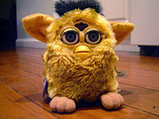

# YDB - 29/9
Asaf Savas Akit[..] örneğin işsizlik hızla artınca devlet aracılığı ile onlara iş yaratmanın, yardım etmenin yolları aranır ve bulunur.Problem bu kafada zatenDevlet bulur, devlet yapar.. Bazen devlet "surasi benim icin onemlidir" der ve orada piyasa disi bir mekanizma olusturur. Sonra dinamik girisimciler gelirler, o mekanizmanin saginda, solunda, cevresinde, ustunde paketleye, paketleye bambaska servisler olustururlar; Yaparlar, cunku firsatcidirlar, ama is o kadar olur ki artik bu sistemde devlet elini goremez hale gelirsiniz - ama altta o curumusluk durmaktadir.Sonra bir gun alttaki mekanizma bir coker ve gerisi pamuk ipligi gibi cozulur. Ve kendini bilmez  bazilari gider bu durumdan firsatcilari suclarlar. Tekrar soyluyorum: Yollari yaparsan o yollarda gidecek arabalar olur. Firsati olusturursan, firsatcilar oraya ususurler. Kapitalistler zaten surekli firsat pesindedir, hele Amerika gibi bir ulkede... Programci bir arkadasim, hic unutmam, Furby denen oyuncagin ciktigi yillardi - bir Furbymania esiyordu. Bu arkadas bir oyuncakci dukkaninin yanindan geciyormus, tam da Furby'lerin satilmaya basladigi ana denk gelmis. Bu da hemen iceri dalmis aninda 10 tane Furby almis! Noel geliyor biliyor ki talep olacak. Noel'e kadar bekledi sonra Furby'leri 3 kati fiyatla eBay uzerinden catir catir satti!Kapitalist bunu yapar.  Firsat alani olusturursan, oraya gelen olur. Ayni sekilde, eger ortada "garantiligi" nispeten yuksek bir durum olusturursan, tatli kar imkani fazla olur ise, insanlar, yani sistemin isleyen aktorleri bu tarafa dogru akarlar.Gokhan OzgunHayatımda çok çok az müze gezdim. Müze gezmeyi hiç mi hiç sevemedim. Bunun nedenini de, kitaba olan düşkünlüğüm gibi, hiçbir zaman anlamamıştım.Ben deMuze gezmeyi ben de sevmem. Sebebini soyle rasyonalize ettim; Bizim cagimiz "istedigim sey istedigim anda (on-demand)" cagidir ve medya bize dijital olarak gelir. Endustriyel cag icin onemli bir kavram olan senkronizasyon bizim icin onemsizdir - muze acildiginda, kurumus, soguk, olu ve Ozgun'un dedigi gibi "baskasi icin onemli olan" eserleri gezeceksin, bu bizim icin olmekten beterdir... Bu eserleri gezme etrafinda "efendim bunlari bilmek entellektuelligin bilmemne gostergesidir" gibi bir kultur olusturulmasi da bizim umrumuzda degildir. Gorulecek onemli bir sey varsa, Net'e tasirsin, 3D imajlar da konulabiliyor, koyarsin, istersek istedigimiz anda goruruz. Istemezsek gormeyiz.Dijital dagitimin eglence tuketimini nasil degistirdigi hakkinda bir yazimiz yakinda gelecek.Etyen Mahcupyan Başbakan Erdoğan’ın Doğan grubunu hedef alan sert tutumu genel olarak tepki gördü ve hatta bu tavrın basın özgürlüğüne ve demokrasiye aykırı düştüğü söylendi. Ancak mesafeli bir yaklaşımla baktığımızda [..], Doğan grubundaki medya organlarının dramatik abartmalarını ciddiye almak zor.[..] meselenin arka planına gittiğimizde Erdoğan’ın Doğan grubuna nazaran daha ‘temiz’ olduğuna dair yaygın bir kanaatin olduğunu gözardı edemeyiz. Bunun nedeni ilan gelirlerinin neredeyse dörtte üçüne hâkim olan bu grubun, geçmişte siyasi iktidarlar üzerinden birçok ekonomik imtiyaz elde etmiş olması. Nitekim bu son gerilimde de Doğan grubunun satın almış olduğu Hilton Oteli arazisine rezidans inşa etme isteğinin etkili olduğu anlaşılıyor. Görünen o ki, bu talebin resmî makamlarca reddedilmesine rağmen ısrarcı olan Doğan Grubu işi hafif yollu şantaja kadar götürmüş. Bunun üzerine zarar etmekte olan CNN-Türk’ün acilen gereksindiği kara frekansını da hükümet engellemiş. Ancak Doğan grubu buna elde tutmakta olduğu Deniz Feneri kartını oynayarak cevap vermiş... Ve böylece Erdoğan’ın ilişkiyi afişe ettiği noktaya kadar gelinmiş.Ancak olay biraz daha karmaşık... Doğan grubunun geçmişte yakın olduğu ve imtiyaz ürettiği hükümetlerin ortak bir özelliği vardı. Bunlar laik kesimin taleplerini öne alan, bu kesim içindeki dar bir işadamı grubuna çıkar sağlayan ‘merkez’ iktidarlardı. Taşranın ülkenin batısında yoğunlaşan ekonomik tahakküm karşısında sürekli kaybettiği bir paylaşım süreciydi bu... AKP ise tam tersine giden bir değişim dinamiğinin ürünü. Bu parti Anadolu’da yükselmekte olan yeni bir burjuvazinin ve kentleşmenin temsilcisi. Üstelik AB üyelik sürecinin yaşandığı, küreselleşmenin Türkiye’yi bölgesel olarak dünyaya entegre ettiği bir dönemin içindeyiz. Bunun anlamı AKP’nin taşıdığı yeni ekonomik sınıfın, yerleşik laik burjuvaziye muhtaç olmadan dünya ile ilişki kurmasıdır.Dahası AB sürecinin çoğulcu demokrasiyi ve çoğunluk iktidarını ima etmesi nedeniyle, söz konusu yeni burjuvazinin uzun süreli bir iktidar olanağı doğmuş durumda. Diğer bir deyişle Türkiye AB çizgisinde kaldığı, demokrasisi sekteye uğramadığı sürece, ekonomik alanın da geçmişe nazaran epeyce farklı bir paylaşım tablosuna yol açması kaçınılmaz. Kısacası demokrasinin yeni bir sınıfsallaşmayı beslediği, imtiyazların artık eski sahiplerine gitmeyeceğini ima eden bir dönemin içindeyiz. Bu durum Doğan grubu ve onun gibi şirketlerin geçici bir yenilgi ile değil, piyasadan silinme tehlikesi ile karşı karşıya olduklarının da habercisi. Çünkü bu şirketlerin hiçbiri bugünlere rekabetçi koşullar altında gelmediler ve dolayısı ile hiçbiri iyi yönetilmiyor...Söz konusu arka plan Doğan grubunun son dönemdeki gazeteciliğini de açıklıyor... Anayasa Mahkemesi’nin 367 kararını, 27 Nisan’da askerin e-muhtırasını destekleyen, aylarca Ergenekon haberi vermediği gibi, darbe girişimini de küçümseyerek gizlemeye çalışan bu kendine has habercilik, aslında Doğan grubunun ne denli sıkışmış olduğunun da göstergesi. Çünkü bugün basın özgürlüğü ve demokrasi havariliği yapan söz konusu yayın organları, epeyce uzun bir süreden bu yana demokrasiyi rafa kaldıracak bir darbe girişiminin de dolaylı destekçiliğini yapmaktaydı.Anlaşılan o ki, laik kesim içinde ekonomik avantajlarını yitireceğini anlayan bazı kesimler, demokrasi içinde bir çıkış yolu göremedikleri ve kesin bir yenilgiye doğru gittikleri değerlendirmesini yaparak daha da ‘devletçi’ bir çizgiye kaymakta beis görmediler. Aslında bu kesimin ille de darbe veya askerî idare istediğini öne süremeyiz. Onların istediği AKP’nin gitmesi ve geçmiştekine benzer bir ‘merkez’ hükümetin başa gelmesi. Bu alternatifin görünür gelecekte demokrasi içinde olamayacağının anlaşılması ise, muhtemelen şimdiki siyasi tercihe ve ona uygun bir ‘gazeteciliğe’ yol açmış durumda...Erdoğan ise artık şantaj ve pazarlığa ‘eyvallah’ demeyecek gibi gözüküyor... Bu daha fazla çatışma demek ve seçimlere yaklaşırken karşımıza muhtemelen bir medya savaşı şeklinde çıkacak...Dogru

zaman:

Eylül 29, 2008

