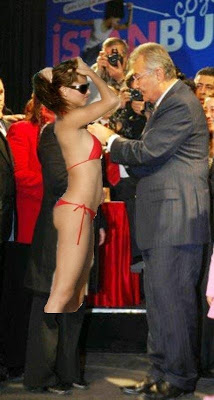

# Baykal'dan mayo acilimi
CHP'nin tum Turkiye'yi kucaklayan bir parti oldugunu soyleyen Baykal, son gunlerdeki acilimlarina devam ediyor. En son rozet taktigi CHP'lilere bir mayolu delegeyi ekleyen Baykal soyle konustu: "Artik CHP'nin ayirimci olmadigini herkes anlamistir saniyorum. Gordugunuz gibi iki senede bir muhakkak bir acilim yapiyoruz".Baykal bu sefer rozet takmak icin bir top model secti, fakat rozeti ilistirecek yer bulamayinca sunlari soyledigi isitildi: "Merak etme kizim ben sana sonra takarim ". Bu sirada CHP uyelerinin "inadina ciplak!" seklinde slogan attiklari gozlendi. Rozet torenini anahtar deliginden izleyen Onur Oymen mutlu oldugunu belirtti. "Halkimizla birlesiyoruz" yorumunu yapti.Cep telefonundan garip sesler gelen Onder Sav'a yorum icin erisilemedi.

zaman:

Aralık 06, 2008

