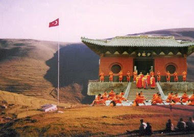
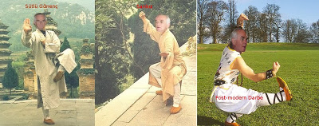
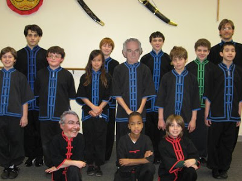

# Damal Tapınağı  Rahipleri
Blogumuz bir habercilik basarisina daha imza atti; muhabirlerimiz son derece gizli bir orgutu gun isigina cikardilar. Bu orgut, Ata'mizin her sene golgesinin gorundugu Damal'da insa edilmis olan bir tapinakta saklaniyor... Tapinaktaki rahipler cok gizli ve olumcul,  "Damal-Fu" adinda bir savas sanatini ogreniyorlar. Bu topluluk, kisaca Damal Tapınağı Rahipleri olarak biliniyor.     En ust seviye Damal-Fu hocasinin Onder Sav oldugu ortaya cikti. Sav, ogrencileri arasinda "Sifu Sav" olarak aniliyor. Sanatta, Ata'mizin gunluk esyalarini silah olarak kullanmak en usta tekniklerden sayiliyor; Bunlar kultablasi firlatmak, burna ve kulaga leblebi sokmak, kafaya raki bosaltip kibrit cakmak olarak sayilabilir. Altta, Sifu Sav tekniklerden bazilarini gosteriyor.     Damal Tapinagi Rahiplerinin rutbeleri var: Bunlar kaz, okuz, kabiz, geyik, duduk, ve sifu olarak siralaniyor. CHP genel baskani Deniz Baykal rahiplerden biri fakat su anda okuz seviyesinde. Rahipler gizliliklerini surdurmek icin dis dunyada rutbeler tersine cevriliyor; En ust seviye olan Sifu Sav'a CHP'de "yardimci" rolu verilmis ve Baykal "baskan" seviyesine getirilmis. Halbuki tapinaktaki rutbeler bunun tam tersi. Bu Sav'i korumak icin yapilmis.    Ergenekon yapilanmasinin Damal Tapinaginin alt islerinden sadece bir tanesi oldugu bildirildi. Demek ki rahiplerin rutbelerine gore Onder Sav Ergenekon'da "1 Numara". Ele gecirilen bir diger belgeye gore Deniz Baykal'in orgutlenmede "100 Numara" oldugu ortaya cikti.    Muhabirlerimiz arastirmalarina devam ediyor... Yeni bilgileri okuyucularimizla   hemen paylasacagiz.  Ucuncu Dalga Geliyor Blog."Ilk bilen siz olun".

zaman:

Ocak 19, 2009

