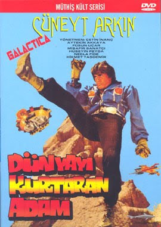

# Cuneyt Arkın Kürt açılımını destekliyor

Bugun unlu sinema sanatcisi Cuneyt Arkin ile roportajimizi sunacagiz. Kendisine Kurt acilimi, AB gibi konular hakkinda sorularimiz oldu.

UDG: Cuneyt Bey merhaba, hosgeldiniz.

Cuneyt Arkin: [cevap]

UDG: Kurt acilimini desteklediginiz haberini aldik. Bunlar dogru mu acaba?

CA: Evet destekliyorum.

UDG: Ama hep Turk kahramanlari oynadiniz filmlerinizde.

CA: Evet ama Kurt kahramanlari da olabilir. Dilaveroglu, Necirvan Gazi, Newroz Pasa.

UDG: Bazilari Turkiye bolunur diyor, evham yaratiyorlar.

CA: [cevap]

UDG: Bu sozlerinize tepki gosterirlerse ne yapacaksiniz?

CA: [cevap]

UDG: Bu filmi hatirladim, pence takmistiniz..

CA: Evet pencelerle karate yaptim

UDG: Unutulmaz bir klasik

CA: Oyle..

UDG: AB'ye girelim mi ne diyorsunuz?

CA: AB taraftari degilim

UDG: Ama para, yatirim gelecek

CA: [cevap]

UDG: Katilim sureci filan iyi olmuyor mu?

CA: [cevap]

UDG: AB Bizans mi?

CA: Bosverin AB'yi.. onlar bize yolu sasirtacak..

UDG: Kurt acilimina tepkili olanlara ne diyorsunuz?

CA: Faşo diyorum

UDG: O ne?

CA: Onu en iyi rahmetli Kemal Sunal soylemisti. [cevap]

UDG: Tesekkurler Cuneyt Bey

CA: N'rica n'ederim.

zaman:

Ağustos 24, 2009

