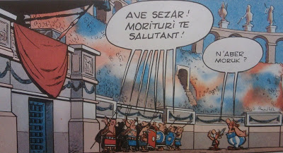

# Asterix
Asterix kulliyati 50 yasina basmis; kutlariz. Bu hikaye daha once bahsettigimiz Roma / Ortacag kulturel fay hatti ile birebir uyumlu. Asterix hikayesinde Roma tum Fransa'yi ele gecirmistir, "tek bir koy haric". O koyun buyucusu ihtiyar bir iksir yaratir, boylece koydekiler super guclere sahip olurlar, Roma'ya direnirler, vs.vs.Bu  altyapidan pek cok hikaye cikacaktir tabii ki, biz de zevkle bunlari okuduk. Bir hikayede Asterix ve (Turkcesi) Hopdediks'in Sezar'in onunde durup herkes Roma (Nazi) selamini cakarken "n'ber moruk!" demeleri ilginc anlardan biriydi mesela. Kahramanlar Ave Ceasar (Heil Hitler) dememislerdi, "direnmislerdi".Fakat, ne yazik ki tarihte boyle bir koy olmadi, olamadi. Roma bugun Fransa denen yeri tamamen isgal etti. O zaman Asterix hikayesi gunumuz Fransizlarinin bilincaltini disa vurmasi acisindan onemli bir veri noktasi... Fransizlar tamamen ele gecirildiler, ama "keske ele gecirilmeseydik", "Romalilasmasaydik" hissiyatlari Asterix uzerinden disa vuruyor olmali.Dipnot olarak belirtmek gerekir: Fransizca dili aslinda zamaninda orada konuslanmis olan Roma askerlerinin konustugu "kaba Latincenin" bir turevidir, bir tur sokak agzidir. "Romantik" bir dil deniyor (romantik icindeki Roma vurgusunu dikkati cekerek devam ediyoruz) "hissiyati kuvvetli bir dil" baglaminda sunu soylemek gerekir, bizce bu dil son derece kaba, igrenc tinilara sahip;  kusmakta olan bir insanin cikardigi sesleri cagristiriyor. Neyse.. zevkler ve renkler.Fransa'nin ana kulturel fay hatti "seckinlik / esitlik (ozgurluk)" izlerini acaba Asterix hikayesi icinde bulabilir miyiz? Roma tarafindan tamamen ele gecirilen bu ulke, seckinlik tarafini "Roma" ile eslestirmis, ve onun karsiti olan tarafini, "esitligi / ozgurlugu" Avrupa'nin "Ortacag" noktasi ile birlesiyor olabilir mi? Olabilir. Dusunmeye deger.

zaman:

Ekim 18, 2009

