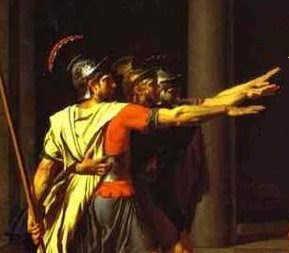
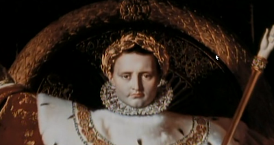
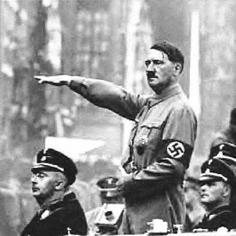
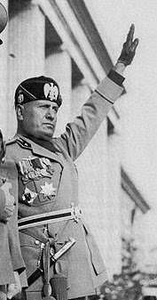

# Avrupa'nin Kulturel Fay Hatti
Ulkelerin kultur kodlarindan ve fay hatlarindan bahsettik. ABD'de bu hat sakinma / serbestlesme noktasindan geciyor, TR'de, Ingiltere'de ise degisik yerlerden... Insanlar bilincaltisal bir sekilde konulari tartarken bu sekilde gruplanma egilimi gosteriyorlar. Tarihlerinde bir taraf ile oteki arasinda bir halat cekme yarisi goruluyor.Peki bir kita olarak Avrupa'nin kendine has bir fay hatti oldugu soylenebilir mi? Acaba Avrupa, tek vucut olarak bir kulturel alt yapiya ve  kendine has kodlara ve bir fay hattina sahip midir? Iddiamiz Avrupa'ya has kulturel fay hattinin "Roma / Ortacag" noktasindan gectigidir [1].Tarihi boyunca Avrupa'yi tanimlayan onemli olaylarin bahsedilen cercevede vuku buldugunu gorebiliriz. Hristiyanlik ve Hz. Isa'nin carmiha gerilmesinde bir taraf militarist, yagmaci, baskici Roma'dir, diger tarafinda sadece din degil, dusunce ve yasam ozgurlugu vardir. Sonralari Ortacag sirasinda Avrupa daha kalabalik "cogulcu" bir yapiya kavusmus ve bu sayede, daginik yapisiyla ronesans / reform evrelerini yasamistir; boylece cekisme noktasi artik kendine has bir "periyoda", ayri olarak  dusunulen bir "hatiraya da" kavusmustur. Tabii bir fay hattindan beklenecek sekilde, karsi taraf olan Roma'nin hayaleti tamamen yokolmamistir.Avrupa'da modernitenin baslangici kabul edilebilecek Fransiz  Devrimi'nden sonra basa gelen diktator Napolyon, Roma imparatorlarinin  ruhani mirascisi oldugunu iddia ediyordu -- ustte yaptirdigi resimde  kafasinda gorulen tac, Roma imparatorlarinin taktigi tacin bir  kopyasidir. Napolyon (o zaman artik guc merkezi  sayilmayan) Roma sehrini ele gecirdiginde, bu olaya adeta dini bir onem  atfetmisti [2].Endustriyellesme ilerledikce, onun uzerinden guclenen asiri merkezilesme, standardizasyon, kitlesellesme, insanlari montaj bantindan cikan tek tip urunlere cevirebilme mentalitesi ile totaliter yapilari tekrar mumkun kilmis ve bazilari bu kolay yoldan gecerek yeni bir tur Roma'nin hayalini takip etmeye baslamistir. Mussolini Italya'sinin, Nazi Almanya'sinin Roma ilhami bir sir degildir. Fetihsel amacindan tutun, Roma askerlerinin selamina kadar Italyanlar ve Nazi Almanya'si Roma Imparatorlugunu kopyalamaya calismistir. Diger tarafta  tepki olarak (halat cekme yarisi devam ediyor) Avrupa'nin geri kalani cogulcu damarini hatirlamis, ve Nazi Almanya'siyla bir varolussal savas vermistir. Direnenler arasindaki Ingiltere, Roma Imparatorlugu zamaninda fethedilen en uzak karakollarindan biriydi, ve Roma'ya karsi gerilla taktikleri kullanmaya kadar varan cok sert bir direnis gostermisti. Yanina disaridan (ama nihayetinde kendisi de Avrupa cikisli olan) Amerika'nin da katilmasiyla 2. Dunya Savasi'nda kazanan taraf cogulcular olmustur. "4. Roma" hayali yerle bir edilmistir.Bu hat uzerinden gunumuzdeki Avrupa'nin olaylara olan tepkisini anlayabilir miyiz? Amerika'nin II. Irak Savasi Avrupa'da "ABD'nin Romalastigi" imajini pekistirdigi icin destek bulamamistir. AB kendi gelecegi acisindan cogulcu bir yapiyi tercih etmis gozukmektedir, "yumusak gucu" ile bu yeni yapinin yayilmasi icin ugrasmaktadir. Amac artik militarist fetihler degildir.Baglantili olarak Turkiye'nin AB iliskilerinde, ona Turkiye icinde eski Roma'yi hatirlatacak hicbir goruntuye iyi gozle bakmayacagini tahmin edebiliriz; yani militarist, baskici, yagmaci 3. Roma ve onun devami [Cumhuriyet olmayan] Cumhuriyet'ten arta kalan tortularda bulunabilecek her turlu totaliter, resmi / gayri-resmi orgutlenme.--[1] Bazilari bu hattin aslinda "din / bilim" noktasindan gectigini iddia edebilir. Buna katilmiyoruz. Tarihte kilisenin bazi evrelerde otoriter, gerici bir goruntuye burundugu dogrudur (ki bu durum kismen hala devam ediyor). Fakat yozlastigi zaman o dinin karsisina bu sefer Luther esliginde "baksa bir din" dikildi.[2] Discovery Channel, Ancient Rome, The Rise Of the Roman Empire, 1. Bolum

zaman:

Ekim 13, 2009

