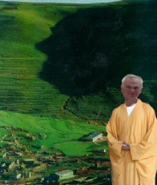
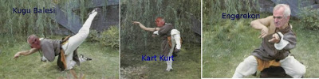

# Tapınak rahatsız
Bir habercilik basarisina imza atan Ucuncu Dalga Geliyor Blog, Damal Tapinagi adli bir yapilanma hakkinda bazi bilgileri kamuoyu ile paylasmisti. Muhabirimiz tekrar tapinaga sizmayi basardi ve cok onemli yeni bilgiler ele gecirdi. Tapinagin son zamanlarda cok rahatsiz oldugu ogrenildi. Olumcul Damal-Fu savas sanatinin yasayan en ust buyuk ustasi ulu Onder Sav, son konjenkturden cok rahatsiz oldugunu tapinaktaki rahiplere anlatiyor. Tapinak, daha once kapatma davasi, halkin kapatilmasi gibi projelere imza atmisti. Buyuk usta Sifu Sav en son olarak Kurt acilimini hedef tahtasina aldi, ogrencilerine "acilimin kapatilmasi" emrini verdi.Sifu Sav olumcul Damal-Fu sanatinin simdiye kadar hic ogretilmemis bazi tekniklerini de ogretmeye basladi. Bu teknikler yuzyillarca gizli tutulmustu, fakat son durumun aciliyeti sebebiyle teknikler su yuzune cikti. Altta ulu Onder Sav bu teknikleri uygularken goruyoruz.Ilk teknik Kugu Balesi uygulanirken rakip gulduruluyor, sonra Kart Kurt ile saskinliga ugratiliyor. En son darbe "Engerekon" ile rakip etkisiz hale getiriliyor.Ucuncu Dalga Geliyor Blog."Ilk bilen siz olun"

zaman:

Ekim 24, 2009

