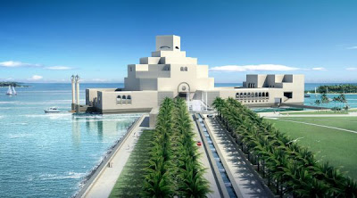

# Katar Islam Muzesi
Katar Islam Muzesini ziyaret ettik. Mimarisi, ic dekoru cok guzel olmus (tasarimci unlu mimar I. M. Pei). Icinde denize dogru uzanan, gemide hissi veren bir manzarasi var. Biz pek muze gezmeyiz, ama binayi  gorme acisindan iyi oldu. Katarlilari da seyrettik. Muze girisinde portatif, ufak bir bilgisayar veriliyor, bilgisayar muze eserlerini kodunu girince gosteriyor, bir yandan eser hakkindaki bilgi de aktariyor. Bizim arkadas bakti, orada gezen Katarli Arap cocuklardan biri aleti kurcalayip alttaki isletim sistemine (windows) girmis, muze programi disindaki oteki programlarla oynuyor. Cocuklar her yerde ayni; kurcalamaya meraklilar. Biz de oyle yaptik; muze gezerken Paint programinda sekiller cizdik :) Girise de masa basinda gorevli iki Ingiliz koymuslar (Katarlilar hicbir is yapmiyor, butun islerde yabancilar istihdam edilmis), aletleri geri verince 'ooh goosh' havasinda Ingilizvari bir takim teatrel yorumlar yaptilar.Islam'da tarihi bilimsel eserler bize en ilginc gelen bolumdu. 7. yuzyildan baslayarak, 3 kitadan, pek cok milletten eserler goruluyor. Anadolu'dan cok sey var bu arada..Tavsiye ederim.

zaman:

Kasım 30, 2009

