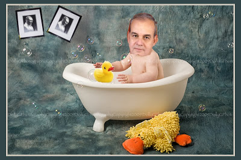

# Yeni bildiri
GK baskani Ilker Basbug en son mesajini vermek icin banyo kuvetini secti. Banyo kuvetinin deniz kuvvetleriyle ilgili bir mesaj icerdigi anlasiliyor. Ayrica arka planda duvarda gorulen "simetrik durmayan" Ata'mizin resimleri silahli kuvvetler uzerindeki "asimetrik emellerle" ilgili bir mesaj. Sabun kopuklerinin ne anlama geldigi halen anlasilamadi, konu hakkinda TSK yetkilileri bir yorum yapmadi. Spekulasyonlar suruyor.

zaman:

Aralık 18, 2009

