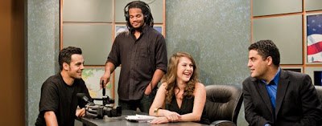

# The Young Turks
Adamimiz Cenk Uygur, Internet temelli televizyon programi The Young Turks ile Fast Company dergisine konu oldu. TYT tam anlamiyla yeni teknolojilerin, yeni ekonominin mumkun kildigi bir olusum. Program sadece YouTube'da gunde 450,000 izleyici cekiyor. Biz bu programa nasil rastgelmistik? Google'daki arama seanslari sirasinda (bizim nesil icin dusunmek ile esanlama gelmeye basladi), galiba jon turkler ile alakali bir seyi ararken rasgele cikmisti... O gunlerde OJ'in Las Vegas'ta yakalanmasi olayi vardi, teyp kaydi cikmisti, Cenk OJ taklidi yapiyordu: "Back against the wall m...f.cker. You stealin' my shit?". Gulmekten yerlere yatmistik. Eh politika da var, seyretmeye basladik. Tum fikirlere katilmasak ta, duruslari genel itibariyle dogru.Karakterler ilginc; fotografta gorulen bayan Ermeni, digeri zenci, oteki ispanyol (hispanic). Salata kasesi.

zaman:

Aralık 07, 2009

