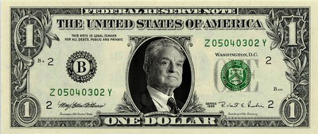

# Ne Mutlu Soroscuyum Diyene
Ulu Onder, yuce kisilik, ornek insan ulu Soros'un piyasada ilk milyon dolarini kazandigi 4 Ocak gunu torenlerle kutlandi. "Kuresel Bayram" gunu ilan edilen bu gunde, siirler okundu, ABD darphane binasina celenk birakildi, borsada spekulasyon yapildi. 'Soros cocuklari' denen grup yuruyus yaparak bir gunluk Soros'un koltuguna oturdular, o sirada bir ulkede pembe devrim bir baskasinda kur dalgalanmasi oldu. Soros cocuklarla ilgilenip harclik olarak borsa tuyosu verdi.

zaman:

Ocak 04, 2010

