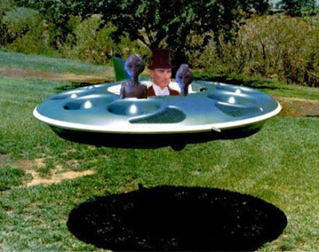
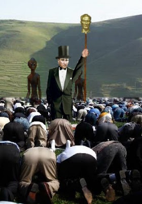
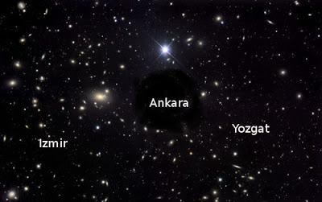

# Ata'nın gemisi inis yaptı!

Heyecanla beklenen an gerceklesti..! Ata'mizin uzay gemisi Damal'a
inis yapti. Bu surpriz ziyaret Damal Tapinagi'nda inanilmaz bir
heyecan yaratti, derhal disari kosan rahipler, Ata'nin ve yaverlerinin
onunde secdeye vardilar.

Ata'nin mucizevi donusu bazi soru isaretlerini ortaya cikardi. Eger
Ata olmediyse, 1938 yilinda olen kimdi? Ilk paylasilan bilgilere gore,
bugun geri gelen biyolojik olarak gercek, esas Ata. 1881'de dunyaya
gonderilen ise Ata'nin biyolojik bir kopyasiydi, yani bir
klondu. Gercek Ata yaslanmiyor ve olmuyor. Ikamet ettigi yer ise
Sirius Galaksisi. Turkler bu galaksiden geliyorlar, demek ki ilk insan
bir Turk. Anlasildigi uzere Turkiye'deki tum kasaba ve sehirler
aslinda Sirius'taki gezegen ve yildiz isimlerine gore isimlendirilmis,
yerleri bile ufaltilmis boyutta Sirius'taki yerler ile birebir ayni.

Bu gezegen ve yildiz isimlerinden bazilari yukaridaki haritada
goruluyor.Haritada ortada bulunan Ankara bir kara delik.Daha fazla
detayi bir sonraki yazida paylasacagiz.

Ucuncu Dalga Geliyor Blog

"Ilk bilen siz olun"

