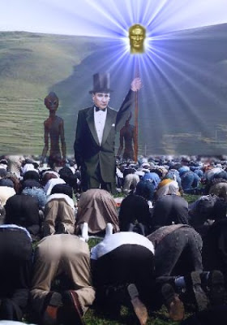
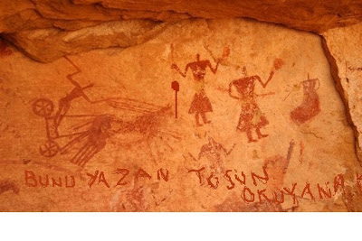
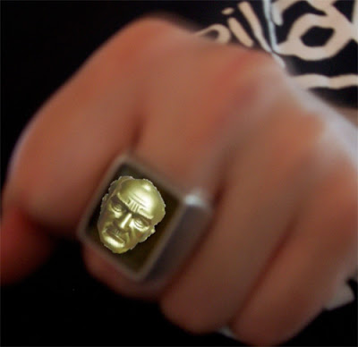

# Gizemli asa
Ata'miz Damal'a inis yaptigindan beri onu yakinen takip ediyoruz. Bugun onun gizemli asasindan bahsedecegiz. Asa'nin ozel gucleri var. Ata istedigi anda ondan cok parlak bir isik cikartabiliyor ve bu isikla karanlikta olan herkes aydinlaniyor. Bu asanin tarihteki bilinen ismi Asena. Isim "bu asa ebene atlar' kelimelerinin parcalari birlestirilerek olusturulmus. Damal Tapinagi rahipleri asanin guclerini iyi biliyorlar.Asena, ilk insan (yani Turk) dunyaya getirildigi zaman Ata'nin yaninda getirdigi asa. Catalhoyuk'teki ilk insanin (yani Turkun) yaptigi magara duvar resimlerinde Asena'nin resmedildigini goruyoruz.Fakat gizemler bununla bitmiyor. Ulu Onder'in ozel yuzukleri var. Bu yuzukler Kizilmaske'nin yuzuklerine benziyor. Aynen o cizgi romanda oldugu gibi bu yuzukle yumruk yiyen kotu kisilerin yuzunde hic cikmayan bir Ata imaji kaliyor. Boyle yumruk yiyenler kamusal alana bir daha giremiyorlar ve otomatik olarak katsayilari artiyor.Daha fazla detaydan bir sonraki yazida bahsedecegiz.Ucuncu Dalga Geliyor Blog"Ilk bilen siz olun"

zaman:

Mart 10, 2010

