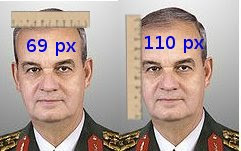

# Brekisefal Degil
Daha once bu olcumu Isik Kosaner icin yapmistik, simdi de "Turk kani" kavramindan bahseden Ilker Basbug icin yapiyoruz. 1930'lu yillarda Mustafa Kemal'in tesvikiyle olusturulan Turk Tarih Tezine gore Turkler brekisefal kafatasina sahiptir. Bu yapiya gore kafatasinin eninin boyuna orani 0.85'ten buyuk olmalidir. Basbug icin piksel bazli yaptigimiz olcumlere gore sonuc 69 / 110 = 0.62 cikiyor. Bu sayi 0.85'ten kucuktur, demek ki TTT'ye gore Ilker Basbug Turk degildir.

zaman:

Temmuz 17, 2010

