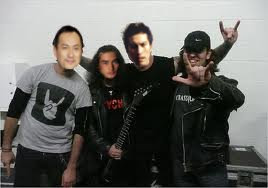

# Uzakdoğu'da ülkücü genclik
Türkcülügün etkileri tüm dünyaya yayılmaya devam ediyor: Japonya'da ilk kez  bir ülkücü ocagı acıldıgı haberi alındı. Basına bildiri veren grup sozcusu Takanoda Sokanomu "biz nihayet kökümüzü kesfettik, tarihimizi inceleyince, aslında 'Ada Türkleri' oldugumuzu anladık" yorumunu yaptı.Sokanomu "tum hayatımızı Türkcülük prensiplerine gore tanzim ediyoruz, sushiyi kımızla yiyoruz, aynı anda kafayı da buluyoruz; boylece sakeye ihtiyacimiz kalmadı, Ulu Turk Ulus'una ait olmak butcemizi de rahatlattı" yorumunu yapti. Genclik kültürünü korumak icin bazi film calismalarini destekleyecek. Japon tarihindeki gelmis gecmis ilk Samuray'i egitenin Battal Gazi oldugu biliniyor; bu tarihi olayi konu alan, basrolde unlu sanatcılar Tako Watanabe ve Abe Ito'nun rol alacagı "Battal Gazi'nin Babasının Oglu" adlı bir film cekilecek, Japonlara gercek kulturlerini anlatacak senlikler hazirlanacak.

zaman:

Eylül 28, 2010

